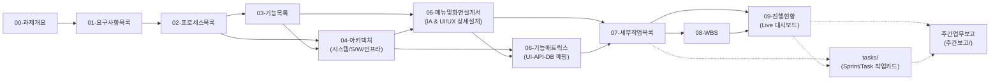

# 00. 과제개요 (Project Overview)

> **과제 마스터 정의서**: 본 문서는 `h2y-music-app` 과제의 전체 개요, 추진 마스터 플랜, 산출물 연계 구조 및 개발 표준을 총괄 정의합니다.

---

## 1. 과제 기본 정보 (FORM-00-05)

| 항목 | 내용 |
| :--- | :--- |
| **과제 ID** | `PRJ-MUSIC-001` |
| **과제명** | 압축파일 직접 스트리밍 재생 지원 음악 플레이어 앱 (`h2y-music-app`) |
| **과제 구분** | 신규 소프트웨어 개발 (Cross-Platform Mobile & Desktop Audio Player - Flutter) |
| **수행 기간** | 2026-09-01 ~ 2026-09-30 (총 20영업일) |
| **개발 방법론** | `Sprint (애자일, 1인 + AI 페어 프로그래밍 파이프라인)` |
| **주요 플랫폼** | **Android (스마트폰/태블릿), iOS (iPhone/iPad), Windows (PC), macOS (Mac), Linux (Desktop)** |
| **핵심 기술 스택**| `Flutter 3.32.5`, `Dart 3.8.1`, `just_audio`, `audio_service`, `archive` |
| **주요 이해관계자** | 프로젝트 오너(PO), 모바일/오디오 엔지니어, 최종 사용자 |
| **주요 변경 사항** | SDLC 표준 개편 (`v2.4`) - Linux(GTK/Desktop) 플랫폼 추가 및 풀 크로스 플랫폼(5대 OS) 지원 체계 완성 |

---

## 2. 과제 배경 및 기대 효과

### 2.1 추진 배경
1. **대용량 음원 아카이브 관리의 비효율성**: 고음질 음원(FLAC, WAV) 및 앨범 단위 음원은 용량 절감을 위해 ZIP, 7Z, RAR 등으로 압축 보관되는 경우가 많으나, 기존 플레이어는 전체 압축을 디스크에 해제해야만 재생이 가능하여 중복 디스크 용량 낭비 및 긴 대기 시간이 발생함.
2. **온디맨드 스트리밍 기술의 필요성**: 수 기가바이트(GB)에 달하는 대용량 압축 파일이라도 디스크 풀림 없이 중앙 디렉토리(Central Directory) 헤더만 고속 인덱싱한 뒤, 선택된 트랙 페이로드만 메모리 청크로 부분 디코딩하여 즉시 재생(TTFP < 500ms)할 수 있는 경량 고성능 음악 플레이어가 요구됨.
3. **완전한 음악 감상 경험 제공**: 압축 파일 내부에 포함된 다양한 오디오 포맷(MP3, FLAC, WAV, AAC, OGG 등) 지원뿐만 아니라, ID3/Vorbis 태그 파싱, 앨범아트 추출, 실시간 가사(LRC) 뷰어, 10밴드 EQ 등 완전한 플레이어 기능 구현 필요.

### 2.2 기대 효과
- **디스크 스토리지 100% 절감**: 압축 해제용 임시 디스크 공간 없이 아카이브 음원을 즉시 재생하여 사용자 로컬 스토리지 보존.
- **초고속 트랙 로딩**: 가상 파일 시스템(VFS) 인덱싱을 통해 10GB 아카이브에서도 500ms 이내에 즉각적인 재생 시작 보장.
- **풍부한 시각적/청각적 UX**: Glassmorphism 기반의 세련된 다크 테마 UI와 실시간 오디오 비주얼라이저, 동기화 가사 창 제공.

---

## 3. 과제 범위 및 아웃라인

```
┌─────────────────────────────────────────────────────────────────────────┐
│                      h2y-music-app 시스템 아웃라인                        │
├────────────────────────────────┬────────────────────────────────────────┤
│ 1. 압축 아카이브 처리 엔진 (ARCHIVE)│ • ZIP / 7Z / RAR / TAR 가상 인덱싱      │
│                                │ • 메모리 청크 온디맨드 스트리밍 디코딩   │
├────────────────────────────────┼────────────────────────────────────────┤
│ 2. 오디오 디코딩/재생 엔진 (AUDIO) │ • Web Audio API / PCM 디코딩 파이프라인 │
│                                │ • Gapless 재생, 10밴드 그래픽 EQ, DSP   │
├────────────────────────────────┼────────────────────────────────────────┤
│ 3. 메타데이터/가사 파서 (TAG)   │ • ID3v2, Vorbis, FLAC 메타데이터 추출   │
│                                │ • 내장/외부 앨범아트 캐싱, LRC 동기화    │
├────────────────────────────────┼────────────────────────────────────────┤
│ 4. 플레이리스트 & 스토리지 (STORAGE)│ • 가상 큐 관리, 스마트 셔플/반복 제어  │
│                                │ • IndexedDB 로컬 플레이리스트 영속화    │
├────────────────────────────────┼────────────────────────────────────────┤
│ 5. 프리미엄 사용자 인터페이스 (UI) │ • Glassmorphism 다크 테마 반응형 UI     │
│                                │ • 비주얼라이저, 단축키, 미디어 세션 연동│
└────────────────────────────────┴────────────────────────────────────────┘
```

---

## 4. 산출물 목록 및 역할 표 (FORM-00-01)

| 순번 | 산출물명 | 파일 링크 | 단계 구분 | 핵심 역할 및 수검 검증 범위 | 관리 상태 |
| :---: | :--- | :--- | :---: | :--- | :---: |
| **00** | 과제개요 | [00-과제개요.md](./00-과제개요.md) | 착수 | 과제 총괄 마스터 플랜, 약어 정의, 문서 연계 체계 정의 | **승인** |
| **01** | 요구사항목록 | [01-요구사항목록.md](./01-요구사항목록.md) | 분석 | 기능적/비기능적 요구사항(`REQ-001~016`) 마스터 정의서 (SRS) | **승인** |
| **02** | 프로세스목록 | [02-프로세스목록.md](./02-프로세스목록.md) | 분석 | 비즈니스 업무 흐름 및 시퀀스 다이어그램(`PROC-01~05`) | **승인** |
| **03** | 기능목록 | [03-기능목록.md](./03-기능목록.md) | 분석 | 모듈별 전수 기능 마스터 정의 (`FUNC-*` Feature List) | **승인** |
| **04** | 아키텍처 | [04-아키텍처.md](./04-아키텍처.md) | **상위설계** | **시스템/소프트웨어/인프라/스트리밍 버퍼링 아키텍처 종합 설계** | **승인** |
| **05** | 메뉴및화면설계서 ⭐ | [05-메뉴및화면설계서.md](./05-메뉴및화면설계서.md) | **상세설계** | **메뉴 구조(IA), 화면/팝업 와이어프레임, 그리드/폼 명세, 5대 테마 디자인 시스템** | **승인** |
| **06** | 기능매트릭스 | [06-기능매트릭스.md](./06-기능매트릭스.md) | 상세설계 | UI-엔진-스토리지 연동 및 CRUD/변경영향도 매트릭스 | **승인** |
| **07** | 세부작업목록 | [07-세부작업목록.md](./07-세부작업목록.md) | 공정관리 | WBS-ID 기반 전수 세부 Task 명세(Seq 01~20) 및 M/D 공수 산정 | **승인** |
| **08** | WBS | [08-WBS.md](./08-WBS.md) | 일정관리 | Mermaid Gantt 차트, 총 가용 공수(Capacity) 분석 및 마일스톤 | **승인** |
| **09** | 진행현황 | [09-진행현황.md](./09-진행현황.md) | 진척관리 | 전수 세부작업 진행 관리 대장(`O` 체크) 및 실시간 대시보드 | **승인** |
| ⭐ | **세부작업카드** | [tasks/ 폴더](./tasks/) | **상세구현** | **Sprint/Task별 DTO, 파일경로, 체크리스트 작업 카드 20종** | **승인** |

---

## 5. 문서 간 데이터 흐름 및 상호 연계도



---

## 6. WBS ID 약어 해설 표 (FORM-00-02)

| WBS ID 요소 | 구성 코드 | 풀스펠링 (Full English Name) | 한글 기능 풀이 설명 |
| :--- | :---: | :--- | :--- |
| **대분류 (제품군)** | `MUSIC` | H2Y Music Application | 압축 음원 재생 플레이어 제품군 |
| **중분류 (모듈)** | `UI` | User Interface & Visuals | 화면 프론트엔드, 테마 및 비주얼라이저 영역 |
| **중분류 (모듈)** | `ARCHIVE` | Archive Extraction & VFS Engine | 압축 아카이브 파싱 및 온디맨드 메모리 스트리밍 영역 |
| **중분류 (모듈)** | `AUDIO` | Audio Pipeline & DSP Engine | Web Audio 디코딩, 오디오 버퍼링 및 10밴드 EQ 영역 |
| **중분류 (모듈)** | `TAG` | Metadata Tag & Lyrics Parser | ID3/Vorbis 메타데이터 파싱, 앨범아트, LRC 가사 영역 |
| **중분류 (모듈)** | `STORAGE` | Local Database & Playlist Engine | IndexedDB 로컬 영속화, 재생목록 큐 관리 영역 |
| **공정단계** | `PP` | Project Preparation | 프로젝트 착수 준비 및 환경 구성 공정 |
| **공정단계** | `AN` | Analysis | 요구사항 분석 및 아키텍처 영향도 분석 공정 |
| **공정단계** | `DE` | Design | 상세 설계, 인터페이스/DTO 및 VFS 구조 설계 공정 |
| **공정단계** | `CO` | Coding & Development | 코어 엔진 및 화면 컴포넌트 구현 공정 |
| **공정단계** | `TE` | Testing & Verification | 단위 테스트, 압축 포맷 정합성 검증 공정 |
| **공정단계** | `IM` | Implementation | 시스템 통합 및 구현 공정 |
| **공정단계** | `TO` | Turn-over | 패키징 빌드 및 릴리즈 운영 이관 공정 |

---

## 7. 주요 약어 정의 표 (FORM-00-03)

| 약어 (Acronym) | 정식 영어 표현 (Full English Name) | 한글 뜻 및 역할 설명 |
| :--- | :--- | :--- |
| **VFS** | Virtual File System | 압축 파일 내부의 디렉토리 구조를 메모리 상에 가상으로 매핑하는 파일 시스템 |
| **TTFP** | Time To First Play | 사용자가 트랙 재생을 클릭한 시점부터 첫 오디오 PCM 신호가 출력되기까지의 소요 시간 |
| **DSP** | Digital Signal Processing | 10밴드 이퀄라이저, 프리앰프, 리버브 등 오디오 신호 디지털 변환 처리 엔진 |
| **LRC** | Lyrics File Format | 타임스탬프(`[mm:ss.xx]`)가 포함된 실시간 가사 동기화 표준 텍스트 포맷 |
| **ID3** | ID3 Metadata Tag | MP3 파일의 헤더/푸터에 저장된 음원 정보(곡명, 아티스트, 앨범, 앨범아트) 포맷 |
| **WASM** | WebAssembly | 고속 압축 해제(libarchive, unrar) 및 오디오 코덱 디코딩을 위한 고성능 바이너리 |
| **M/D** | Man-Day | 1인의 개발자가 1일(8시간) 동안 전담 투입되어 수행하는 작업 공수 단위 |

---

## 8. 문서 간 상호 연동 매트릭스 표 (FORM-00-04)

| 검증 영역 | 참조 문서 1 | 참조 문서 2 | 비고 |
| :--- | :--- | :--- | :--- |
| **요구사항 ↔ 프로세스** | [01-요구사항목록.md](./01-요구사항목록.md) | [02-프로세스목록.md](./02-프로세스목록.md) | 업무 흐름과 시스템 처리 시퀀스 일치 검증 |
| **비즈니스 흐름 ↔ 기능** | [02-프로세스목록.md](./02-프로세스목록.md) | [03-기능목록.md](./03-기능목록.md) | 프로세스 단계별 호출 컴포넌트(`FUNC-`) 일치 검증 |
| **기능 ↔ 아키텍처** | [03-기능목록.md](./03-기능목록.md) | [04-아키텍처.md](./04-아키텍처.md) | 기능별 계층 분리 및 스트리밍 파이프라인 정합성 |
| **아키텍처 ↔ UI 화면설계** | [04-아키텍처.md](./04-아키텍처.md) | [05-메뉴및화면설계서.md](./05-메뉴및화면설계서.md) | 5대 테마, IA 메뉴 트리 및 화면/팝업 와이어프레임 설계 |
| **화면설계 ↔ 매트릭스** | [05-메뉴및화면설계서.md](./05-메뉴및화면설계서.md) | [06-기능매트릭스.md](./06-기능매트릭스.md) | UI-엔진-스토리지 간 CRUD 및 변경영향도 검증 |
| **기능 ↔ 세부작업 연동** | [06-기능매트릭스.md](./06-기능매트릭스.md) | [07-세부작업목록.md](./07-세부작업목록.md) | `FUNC-` 식별자와 `WBS-` Task 대상 기능 100% 일치 |
| **공수 및 일정 동기화** | [07-세부작업목록.md](./07-세부작업목록.md) | [08-WBS.md](./08-WBS.md) | 전체 Task 공수(18.0 M/D)와 WBS Gantt 차트 완전 일치 |
| **실시간 진척 추적성** | [07-세부작업목록.md](./07-세부작업목록.md) | [09-진행현황.md](./09-진행현황.md) | 전수 Task의 실시간 진행 상태(`O`) 및 SPI 편차 추적 |
| **작업 카드 연동** | [07-세부작업목록.md](./07-세부작업목록.md) | [tasks/ 폴더](./tasks/) | Seq 001~020 전수 세부 구현 스펙 1:1 매핑 |

---

## 9. 문서 공통 변경 이력 표 (FORM-08-07)

| 버전 | 일자 | 변경 내용 | 작성자 |
| :---: | :---: | :--- | :---: |
| `v1.0` | 2026-09-01 | 초판 제정: 압축파일 재생 음악 플레이어 앱 산출물 총괄 마스터 정의 | 풀스택 개발팀 |
| `v1.1` | 2026-09-01 | 개정 표준 반영: 07-진행현황 산출물 신설 및 공정단계 2자리 영문 대문자 코드 체계 표준화 | 풀스택 개발팀 |
| `v2.0` | 2026-09-01 | SDLC 표준 대개편: 04-아키텍처 신설, 00~08 산출물 체계화 및 tasks/ 작업카드 폴더 연동 | 풀스택 개발팀 |
| `v2.1` | 2026-09-04 | 크로스 플랫폼 표준 전환: Flutter + just_audio + audio_service 5대 OS 지원 체계 확립 | 모바일 오디오팀 |
| `v2.2` | 2026-09-05 | 산출물 표준 전면 개편: 05-메뉴및화면설계서 신설에 따른 00~09 체계 완비 및 연동 갱신 | 풀스택 개발팀 |
