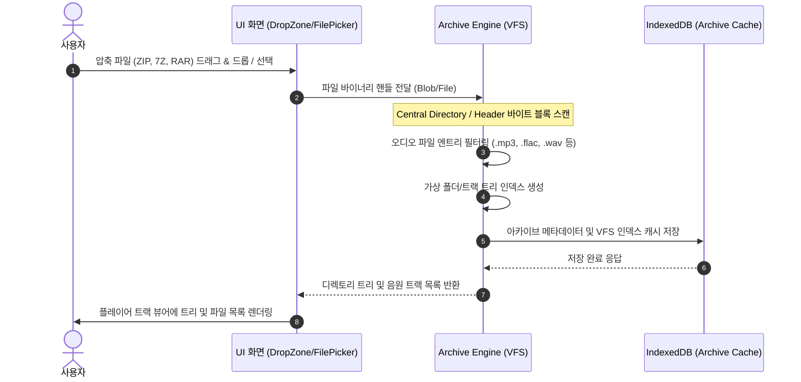
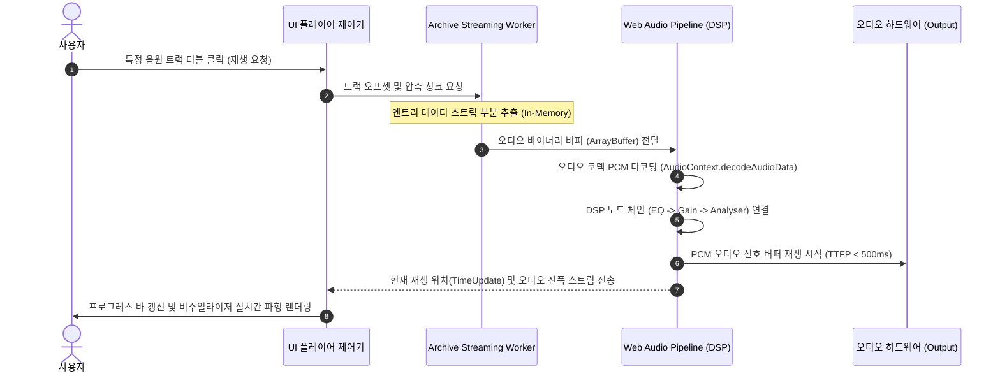
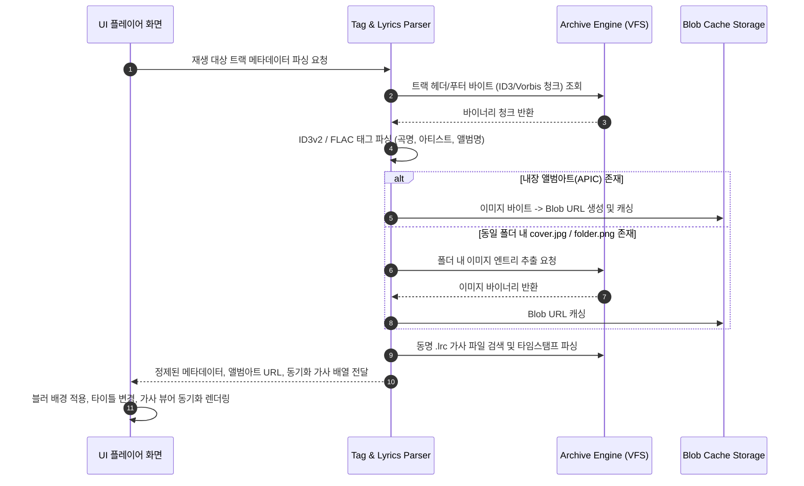
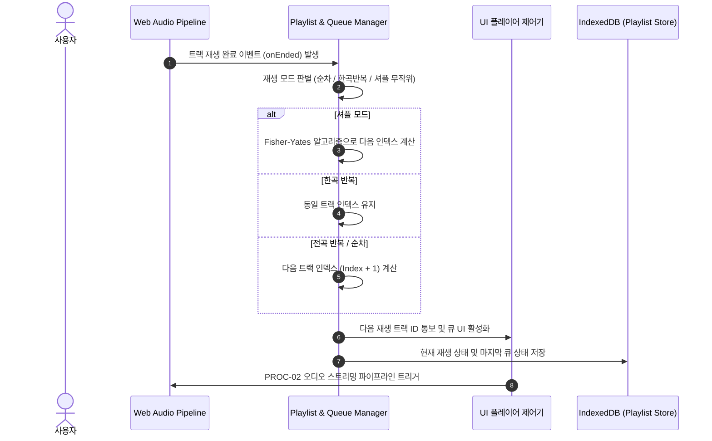
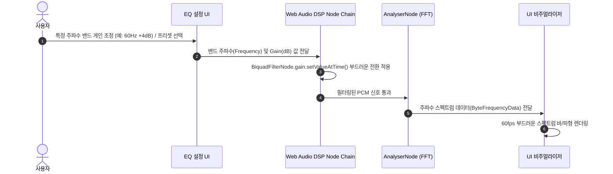

# 02. 프로세스목록 (Process Specification)

> **프로세스 정의서**: 시스템의 핵심 비즈니스 흐름과 데이터 처리 파이프라인을 시퀀스 다이어그램 및 단계별 인터랙션 명세로 정의합니다.

---

## 1. 프로세스 목록 요약 (FORM-02-01)

| 프로세스 ID | 프로세스명 | 대분류 | 관련 기능 수 | 핵심 역할 및 설명 |
| :---: | :--- | :---: | :---: | :--- |
| `PROC-01` | 압축파일 로드 및 가상 인덱싱 | 아카이브 파싱 | 3 | 디스크 해제 없이 아카이브 헤더를 파싱하여 메모리 VFS 트리를 구성하는 흐름 |
| `PROC-02` | 온디맨드 스트리밍 및 재생 | 오디오 파이프라인 | 4 | 선택한 트랙의 압축 청크를 메모리 버퍼로 실시간 디코딩하여 즉시 재생하는 흐름 |
| `PROC-03` | 메타데이터/앨범아트/가사 비동기 추출 | 태그 파싱 | 3 | ID3/Vorbis 태그 파싱, 앨범 커버 Blob URL 생성 및 LRC 가사 동기화 흐름 |
| `PROC-04` | 플레이리스트 큐 관리 및 연속 재생 | 재생목록 제어 | 2 | 트랙 종료 감지, 스마트 셔플/반복 큐 전환 및 재생 상태 영속화 흐름 |
| `PROC-05` | 10밴드 EQ 및 DSP 오디오 필터링 | 오디오 DSP | 2 | Web Audio BiquadFilter 노드 체인을 통한 주파수 대역 게인 제어 및 비주얼라이저 흐름 |

---

## 2. 세부 프로세스 정의

### 2.1 PROC-01: 압축파일 로드 및 가상 디렉토리 인덱싱 프로세스

#### 📊 시퀀스 다이어그램 (Mermaid)

#### 📋 프로세스 단계 명세 (FORM-02-02)
| 단계 | 단계명 | 설명 | 관련 기능 ID |
| :---: | :--- | :--- | :---: |
| 1 | 파일 유입 감지 | FilePicker 또는 Drag & Drop 이벤트를 통해 로컬 압축 파일 스트림 객체 수신 | `FUNC-UI-001` |
| 2 | 헤더 바이트 스캔 | 전체 파일을 풀지 않고 끝단의 Central Directory 헤더만 부분 Range Read | `FUNC-ARCHIVE-001` |
| 3 | VFS 트리 생성 | 엔트리 목록 중 오디오 확장자 파일만 필터링하여 인메모리 트리 노드 구성 | `FUNC-ARCHIVE-001` |
| 4 | 인덱스 캐시 저장 | 생성된 VFS 파일 맵 정보를 로컬 IndexedDB에 캐싱하여 재진입 가속 | `FUNC-STORAGE-002` |
| 5 | 화면 목록 표출 | 가상 디렉토리 구조 및 음원 트랙 리스트를 UI 트랙 뷰어에 즉시 표시 | `FUNC-UI-001` |

#### ⚙️ 시스템 연동 영향도 (FORM-02-03)
| 단계 | 단계명 | 설명 | 관련 서브모듈 / SQL ID |
| :---: | :--- | :--- | :--- |
| 2~3 | 가상 인덱싱 | WASM 기반 고속 아카이브 헤더 스캐너 구동 | `ArchiveReader.wasm / CentralDirectoryParser` |
| 4 | 인덱스 캐싱 | 브라우저/로컬 스토리지에 아카이브 VFS 스키마 적재 | `IndexedDB: archive_index_store` |

---

### 2.2 PROC-02: 온디맨드 오디오 버퍼 스트리밍 및 재생 프로세스

#### 📊 시퀀스 다이어그램 (Mermaid)

#### 📋 프로세스 단계 명세 (FORM-02-02)
| 단계 | 단계명 | 설명 | 관련 기능 ID |
| :---: | :--- | :--- | :---: |
| 1 | 재생 이벤트 수신 | 사용자가 트랙을 선택하면 트랙 고유 식별자 및 아카이브 엔트리 오프셋 확인 | `FUNC-UI-001` |
| 2 | 메모리 청크 추출 | 디스크 파일 I/O 없이 해당 트랙의 압축 바이트 블록만 Worker 스레드에서 추출 | `FUNC-ARCHIVE-002` |
| 3 | PCM 오디오 디코딩 | 수신된 ArrayBuffer를 Web Audio API 컨텍스트에서 즉각 PCM 버퍼로 디코딩 | `FUNC-AUDIO-001` |
| 4 | DSP 노드 체이닝 | 볼륨 노드, 10밴드 EQ 필터, 스펙트럼 분석기(AnalyserNode)에 연결 | `FUNC-AUDIO-002`, `FUNC-AUDIO-003` |
| 5 | 실시간 사운드 출력 | 오디오 하드웨어로 출력 개시 및 UI에 시간 업데이트 이벤트 브로드캐스팅 | `FUNC-AUDIO-002` |

#### ⚙️ 시스템 연동 영향도 (FORM-02-03)
| 단계 | 단계명 | 설명 | 관련 서브모듈 / SQL ID |
| :---: | :--- | :--- | :--- |
| 2 | 메모리 스트리밍 | 백그라운드 Worker 스레드 비동기 압축 해제 | `Worker: ArchiveStreamWorker.js` |
| 3~4 | Web Audio DSP | AudioContext 버퍼 디코딩 및 필터 그래프 연결 | `AudioEngine: WebAudioPipeline.ts` |

---

### 2.3 PROC-03: 메타데이터/가사/앨범아트 비동기 추출 프로세스

#### 📊 시퀀스 다이어그램 (Mermaid)

#### 📋 프로세스 단계 명세 (FORM-02-02)
| 단계 | 단계명 | 설명 | 관련 기능 ID |
| :---: | :--- | :--- | :---: |
| 1 | 태그 청크 분석 | 음원 파일의 헤더(ID3v2) 또는 푸터(ID3v1) 바이트 블록만 우선 읽기 | `FUNC-TAG-001` |
| 2 | 메타정보 파싱 | UTF-8/EUC-KR 인코딩을 판별하여 타이틀, 아티스트, 앨범 정보 파싱 | `FUNC-TAG-001` |
| 3 | 앨범아트 캐싱 | 내장 APIC 이미지 또는 동봉 커버 이미지를 추출하여 메모리 Blob URL 생성 | `FUNC-TAG-002` |
| 4 | 가사 타임라인 파싱 | `.lrc` 파일의 `[00:12.34]` 타임스탬프를 초 단위 인덱스로 파싱하여 배열화 | `FUNC-TAG-003` |
| 5 | UI 동적 바인딩 | 추출된 정보를 플레이어 메인 뷰, 앨범아트 블러 배경, 가사 창에 반영 | `FUNC-UI-001` |

---

### 2.4 PROC-04: 플레이리스트 큐 관리 및 연속 재생 프로세스

#### 📊 시퀀스 다이어그램 (Mermaid)

---

### 2.5 PROC-05: 10밴드 EQ 및 DSP 오디오 필터링 프로세스

#### 📊 시퀀스 다이어그램 (Mermaid)

---

## 3. 관련 문서 체계 (FORM-02-05)

| 구분 | 문서명 | 설명 |
| :--- | :--- | :--- |
| **상위 체계** | [00-과제개요.md](./00-과제개요.md) | 과제 마스터 플랜 및 전체 산출물 데이터 흐름 연계 |
| **선행 요건** | [01-요구사항목록.md](./01-요구사항목록.md) | 프로세스별 충족 요구사항(`REQ-001~REQ-016`) 명세 |
| **기능 구현** | [03-기능목록.md](./03-기능목록.md) | 프로세스 실행 시 호출되는 세부 기능 단위(`FUNC-*`) 정의 |
| **영향도 대조** | [04-기능매트릭스.md](./04-기능매트릭스.md) | 데이터베이스 및 인프라 CRUD 매트릭스 대조 |
| **세부 작업** | [05-세부작업목록.md](./05-세부작업목록.md) | 프로세스 구현을 위한 세부 WBS Task 정의 |
| **진행 현황** | [07-진행현황.md](./07-진행현황.md) | 프로세스별 모듈 구현 진행 상태 트래킹 |

---

## 4. 문서 공통 변경 이력 표 (FORM-06-07)

| 버전 | 일자 | 변경 내용 | 작성자 |
| :---: | :---: | :--- | :---: |
| `v1.0` | 2026-09-01 | 초판 제정: 압축 로드, 온디맨드 스트리밍, 태그/가사, 큐, EQ 5대 프로세스 수립 | 풀스택 개발팀 |
| `v1.1` | 2026-09-01 | 개정 표준 반영: 관련 문서 체계 보강 및 07-진행현황 연계 추가 | 풀스택 개발팀 |
