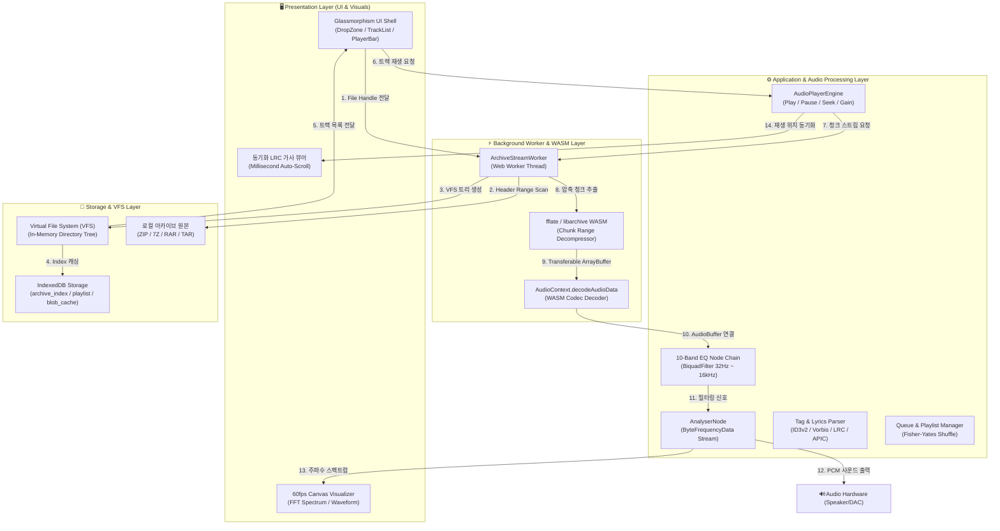

# 04. 아키텍처 (Architecture Specification)

> **상위설계 아키텍처 정의서**: 도출된 요구사항(`01`), 프로세스(`02`), 기능(`03`)을 기술적으로 실현하기 위한 시스템 구성도, 소프트웨어 레이어드 아키텍처, 데이터/스트리밍 파이프라인, 하드웨어 및 인프라 사양을 종합 설계합니다.

---

## 1. 시스템 아키텍처 개요

### 1.1 설계 목표 및 핵심 원칙
1. **무압축풀림 온디맨드 스트리밍**: 디스크에 수 GB의 압축을 풀지 않고 Central Directory 헤더 인덱싱 기반의 메모리 부분 청크 디코딩 파이프라인 구축.
2. **UI 스레드 완전 격리**: 대용량 압축 파싱 및 PCM 디코딩 작업을 Web Worker 및 WASM(WebAssembly)으로 위임하여 60fps 무지연 UI 렌더링 보장.
3. **고음질 오디오 DSP 엔진**: Web Audio API 노드 그래프를 활용한 10밴드 그래픽 EQ, 볼륨 로그 감쇠 및 실시간 스펙트럼 분석 파이프라인 실현.

### 1.2 전체 시스템 아키텍처 구성도 (System Architecture Diagram)

---

## 2. 소프트웨어 레이어드 아키텍처 명세 (FORM-04-01)

| 상위 제품군 | 모듈명 (Module Name) | 대문자 풀명칭 (Code) | 주요 기술 스택 | 매핑 영역 | 핵심 역할 및 아키텍처 책임 |
| :---: | :--- | :---: | :--- | :--- | :--- |
| `MUSIC` | User Interface | `UI` | Vanilla CSS, HTML5, TypeScript, Canvas API | Presentation Layer | 반응형 Glassmorphism UI, 60fps 오디오 스펙트럼 비주얼라이저, 단축키 처리 |
| `MUSIC` | Archive VFS Engine | `ARCHIVE` | WebAssembly (libarchive/fflate), Web Worker | Infrastructure Layer | 아카이브 헤더 스캔, VFS 가상 트리 매핑, 온디맨드 메모리 청크 스트리밍 |
| `MUSIC` | Audio Pipeline Engine | `AUDIO` | Web Audio API, AudioContext, BiquadFilter | Application Layer | PCM 디코딩, 재생 제어, 10밴드 EQ DSP 처리 및 TTFP 최적화 |
| `MUSIC` | Metadata Tag Parser | `TAG` | Music-Metadata JS, TextDecoder, Blob API | Domain Layer | ID3/FLAC 태그 추출, 앨범아트 Blob 캐싱, LRC 동기화 가사 파싱 |
| `MUSIC` | Local Storage Manager | `STORAGE` | IndexedDB (idb wrapper), LocalStorage | Infrastructure Layer | 플레이리스트 영속화, 큐 상태 관리, 사용자 설정값 및 앨범아트 캐싱 |

---

## 3. 하드웨어 및 인프라 사양 명세 (FORM-04-02)

| 구분 | 표준 권장 사양 (Standard Spec) | 여유 고성능 사양 (High-End Spec) | 비고 |
| :--- | :--- | :--- | :--- |
| **프로세서 (CPU)** | Intel Core i3 / Apple Silicon M1 (4코어 이상) | Intel Core i7 / Apple Silicon M2/M3 Pro (8코어 이상) | WASM 아카이브 압축 해제 및 DSP 연산 |
| **메모리 (RAM)** | 4GB RAM 이상 | 16GB RAM 이상 | 대용량 10GB 아카이브 처리 시에도 150MB 내외 사용 |
| **디스플레이** | 1280 x 720 (HD) 해상도 이상 | 2560 x 1440 (QHD) / 4K Retina Display | 반응형 Glassmorphism UI 최적 렌더링 |
| **오디오 출력** | 16-bit 44.1kHz 표준 스테레오 사운드 카드 | 24-bit 96kHz / 192kHz Hi-Res 오디오 DAC | 무손실 FLAC 음원 재생 지원 |
| **운영체제 (OS)** | macOS 12+, Windows 10/11, Modern Web Browser | macOS 14+ Sonoma, Windows 11 Pro 64-bit | 크로스 플랫폼 지원 |

---

## 4. 자원 할당 명세 (FORM-04-03)

| 구분 | 개별 프로세스 명칭 (Process Name) | CPU 코어 배분 | RAM 메모리 할당 | 디스크 용량 할당 | 자원 제어 및 OS/Windows 설정 가이드 |
| :--- | :--- | :---: | :---: | :---: | :--- |
| **메인 UI 스레드** | `MusicApp-MainRenderer` | 1 Core (10~20%) | Max 80MB | < 10MB | 60fps Canvas 비주얼라이저 및 UI 렌더링 전담 |
| **압축 스트리밍 워커** | `ArchiveStreamWorker` | 1 Core (피크 시 30%) | Max 100MB | 0MB (In-Memory) | 디스크 I/O 없이 메모리 상에서 청크 디코딩 후 GC |
| **오디오 DSP 렌더러** | `AudioContext-Thread` | OS Audio Thread | Max 50MB | 0MB | 하드웨어 버퍼 실시간 PCM 스트림 출력 |
| **로컬 캐시 스토리지** | `IndexedDB-Store` | Background I/O | Max 50MB | Max 500MB | 앨범아트 썸네일 Blob 및 재생목록 인덱스 캐싱 |

---

## 5. 물리 디스크 분리 구성안 (FORM-04-04)

| 드라이브 구분 | 디스크 용량 (표준 기준) | 디스크 용량 (대용량 기준) | 탑재 대상 프로세스 및 저장 폴더 | 디스크 I/O 성격 및 분리 효과 |
| :--- | :---: | :---: | :--- | :--- |
| **시스템/앱 영역 (`OS/App`)** | 100MB | 200MB | 애플리케이션 번들 및 실행 바이너리 | 순수 읽기 전용으로 빠른 앱 구동 보장 |
| **캐시/DB 영역 (`Cache/DB`)** | 500MB | 2GB | `IndexedDB` 앨범아트 및 메타데이터 캐시 | 주기적 비동기 쓰기로 메인 재생 끊김 방지 |
| **음원 아카이브 (`User Data`)** | 사용자 스토리지 | 사용자 스토리지 | 사용자의 로컬 ZIP / 7Z / RAR 파일 원본 | **전체 압축 해제 불필요**로 디스크 추가 소비 0 byte |

---

## 6. 네트워크 포트 및 통신 인터페이스 (FORM-04-05)

| 구분 | 서비스/모듈명 | 프로토콜 | 포트번호 | 송신처 (Source) | 수신처 (Destination) | 용도 및 비고 |
| :--- | :--- | :---: | :---: | :--- | :--- | :--- |
| **로컬 개발 서버** | `Vite Dev Server` | HTTP/WS | `3000` / `5173` | 개발자 브라우저 | 로컬 머신 | HMR 핫 리로딩 및 로컬 개발용 |
| **미디어 세션** | `MediaSession API` | IPC | Internal | 브라우저 렌더러 | OS Notification Center | Now Playing 곡명/커버/컨트롤러 동기화 |
| **오디오 출력** | `Web Audio HAL` | CoreAudio / WASAPI | Internal | AudioContext Node | 오디오 드라이버/DAC | 저지연 PCM 하드웨어 다이렉트 출력 |

---

## 7. 오디오 청크 버퍼링 및 스트리밍 캐싱 명세 (FORM-04-06)

| 버퍼링/스트림 대상 | 청크 크기 | 선행 로딩 (Pre-buffer) | 보존 정책 (Retention) | 캐시 저장소 | 주요 처리 모듈 |
| :--- | :---: | :---: | :---: | :---: | :--- |
| **Central Directory 헤더** | Variable (64KB~2MB) | 아카이브 로드 즉시 | 세션 유지 동안 인메모리 보존 | `In-Memory VFS Map` | `ArchiveAnalyzer / VFSTreeBuilder` |
| **현재 재생 트랙 PCM** | Full Track AudioBuffer | 즉시 로딩 (TTFP < 500ms) | 재생 중 보존 (트랙 변경 시 GC) | `AudioContext Memory` | `AudioDecoder / ChunkStreamer` |
| **다음 곡 프리페치 버퍼** | 최초 30초 (약 5MB) | 현재 곡 90% 재생 시점 | 다음 곡 재생 시 즉시 승격 | `Transferable ArrayBuffer` | `QueueManager / StreamWorker` |
| **앨범아트 썸네일 Blob** | 이미지 원본 (100KB~2MB) | 트랙 인덱싱 시 비동기 | 영구 보존 (LRU 기반 삭제) | `IndexedDB: blob_cache` | `AlbumArtExtractor / BlobCache` |
| **LRC 가사 타임라인 데이터** | 텍스트 (10KB 내외) | 트랙 로드 시 파싱 | 재생목록 유지 동안 보존 | `In-Memory Object Map` | `LrcParser / LyricsViewer` |

---

## 8. 문서 공통 변경 이력 표 (FORM-07-07)

| 버전 | 일자 | 변경 내용 | 작성자 |
| :---: | :---: | :--- | :---: |
| `v1.0` | 2026-09-01 | 초판 제정: SDLC 상위설계 표준에 따른 시스템/소프트웨어/인프라/버퍼링 아키텍처 종합 설계 | 풀스택 개발팀 |
