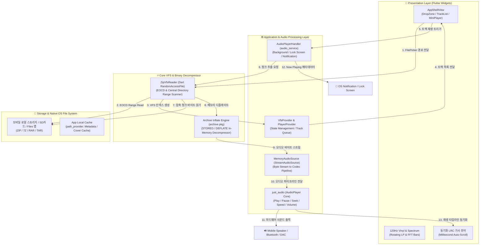

# 04. 아키텍처 (Architecture Specification)

> **상위설계 아키텍처 정의서**: 도출된 요구사항(`01`), 프로세스(`02`), 기능(`03`)을 기술적으로 실현하기 위한 시스템 구성도, 소프트웨어 레이어드 아키텍처, 데이터/스트리밍 파이프라인, 하드웨어 및 인프라 사양을 종합 설계합니다.

---

## 1. 시스템 아키텍처 개요

### 1.1 설계 목표 및 핵심 원칙
1. **무압축풀림 온디맨드 스트리밍**: 스마트폰 내장 메모리/SD카드/iCloud의 대용량 ZIP 파일에서 Central Directory 헤더만 Range Read하여 디스크 해제 없이 즉시 재생(TTFP < 500ms).
2. **모바일 백그라운드 오디오 완벽 보장**: `just_audio` 및 `audio_service` 연동을 통해 화면 꺼짐(Lock Screen), 알림바 미디어 컨트롤, 블루투스 이어폰 버튼 및 Android Auto / Apple CarPlay 완벽 대응.
3. **120Hz Impeller GPU 렌더링**: Flutter Skia/Impeller 엔진을 통해 네온 Glassmorphism UI, 회전 바이닐 디스크, 10밴드 EQ 및 동기화 가사 스크롤을 60~120fps로 매끄럽게 구동.

### 1.2 전체 시스템 아키텍처 구성도 (System Architecture Diagram)

---

## 2. 소프트웨어 레이어드 아키텍처 명세 (FORM-04-01)

| 상위 제품군 | 모듈명 (Module Name) | 대문자 풀명칭 (Code) | 주요 기술 스택 | 매핑 영역 | 핵심 역할 및 아키텍처 책임 |
| :---: | :--- | :---: | :--- | :--- | :--- |
| `MUSIC` | User Interface | `UI` | Flutter 3.x, Dart 3.x, Google Fonts, Glassmorphism | Presentation Layer | 120Hz 반응형 UI, 회전 바이닐 디스크, 오디오 스펙트럼 비주얼라이저, 모바일 제스처 |
| `MUSIC` | Archive VFS Engine | `ARCHIVE` | Dart RandomAccessFile, `archive` package | Infrastructure Layer | 아카이브 Central Directory 스캔, VFS 가상 트리 매핑, 온디맨드 메모리 청크 스트리밍 |
| `MUSIC` | Audio Pipeline Engine | `AUDIO` | `just_audio`, `StreamAudioSource`, CoreAudio / OpenSL | Application Layer | PCM/코덱 디코딩, 재생 제어, 10밴드 EQ DSP 처리 및 TTFP < 500ms 최적화 |
| `MUSIC` | Background Audio Service | `SERVICE` | `audio_service`, MediaSession, LockScreen Notification | Service Layer | 잠금화면, 알림바 미디어 컨트롤, 블루투스 이어폰 버튼 및 백그라운드 재생 유지 |
| `MUSIC` | State & Storage Manager | `STORAGE` | `provider`, `path_provider`, `file_picker` | Domain Layer | SAF/파일 앱 선택기 연동, 재생목록 큐 상태 관리, 사용자 설정값 캐싱 |

---

## 3. 하드웨어 및 인프라 사양 명세 (FORM-04-02)

| 구분 | 표준 권장 사양 (Standard Spec) | 여유 고성능 사양 (High-End Spec) | 비고 |
| :--- | :--- | :--- | :--- |
| **타깃 플랫폼 및 OS** | Android 8.0+, iOS 14.0+, Windows 10+, macOS 12+, Linux (Ubuntu 20.04+) | Android 14+, iOS 17+, Windows 11, macOS 14+, Linux (Ubuntu 24.04+) | 스마트폰, 태블릿, PC(Win/Mac/Linux) 지원 |
| **프로세서 (AP/CPU)** | ARM64 옥타코어 / Intel Core i3 / Apple A12 Bionic 이상 | Snapdragon 8 Gen 2/3 / Intel Core i7 / Apple M-Series | In-Memory 디플레이트 및 120Hz 렌더링 |
| **메모리 (RAM)** | 3GB RAM 이상 | 8GB~16GB RAM 이상 | 대용량 10GB 아카이브 처리 시에도 150MB 내외 유지 |
| **오디오 출력** | 16-bit 44.1kHz 표준 스테레오 스피커 / 이어폰 | 24-bit 96kHz / 192kHz Hi-Res 오디오 DAC | 무손실 FLAC / Hi-Res 음원 재생 지원 |

---

## 4. 자원 할당 명세 (FORM-04-03)

| 구분 | 개별 프로세스 명칭 (Process Name) | CPU 코어 배분 | RAM 메모리 할당 | 디스크 용량 할당 | 자원 제어 및 OS 설정 가이드 |
| :--- | :--- | :---: | :---: | :---: | :--- |
| **메인 UI 스레드** | `Flutter Main Isolate` | 1 Core (10~20%) | Max 70MB | < 10MB | Impeller GPU 렌더링 및 60~120fps 애니메이션 전담 |
| **압축 스트리밍 엔진** | `ZipVfsReader Isolate` | 1 Core (순간 25%) | Max 80MB | 0MB (In-Memory) | 디스크 I/O 없이 메모리 상에서 청크 디코딩 후 즉시 GC |
| **오디오 서비스** | `AudioService Background Service` | OS Audio Thread | Max 40MB | 0MB | 화면 꺼짐 상태에서도 안전한 오디오 출력 유지 |
| **로컬 캐시 스토리지** | `AppCacheManager` | Background I/O | Max 30MB | Max 200MB | 앨범아트 썸네일 및 재생목록 인덱스 캐싱 |

---

## 5. 오디오 청크 버퍼링 및 스트리밍 캐싱 명세 (FORM-04-06)

| 버퍼링/스트림 대상 | 청크 크기 | 선행 로딩 (Pre-buffer) | 보존 정책 (Retention) | 캐시 저장소 | 주요 처리 모듈 |
| :--- | :---: | :---: | :---: | :---: | :--- |
| **Central Directory 헤더** | Variable (64KB~2MB) | 아카이브 로드 즉시 | 세션 유지 동안 인메모리 보존 | `In-Memory VFS Index` | `ZipVfsReader` |
| **현재 재생 트랙 오디오** | Full Track Stream | 즉시 로딩 (TTFP < 500ms) | 재생 중 보존 (트랙 변경 시 GC) | `MemoryAudioSource` | `just_audio / StreamSource` |
| **잠금화면 미디어 메타데이터** | 텍스트 / 이미지 URL | 트랙 재생 즉시 | 현재 재생 중 보존 | `MediaItem` | `AudioPlayerHandler` |

---

## 6. 문서 공통 변경 이력 표 (FORM-08-07)

| 버전 | 일자 | 변경 내용 | 작성자 |
| :---: | :---: | :--- | :---: |
| `v1.0` | 2026-09-01 | 초판 제정: SDLC 상위설계 표준에 따른 시스템/소프트웨어/인프라/버퍼링 아키텍처 종합 설계 | 풀스택 개발팀 |
| `v2.0` | 2026-09-04 | 크로스 플랫폼 모바일 표준 전환: Flutter + just_audio + audio_service 기반 아키텍처로 전면 갱신 | 모바일 오디오 개발팀 |
| `v2.2` | 2026-09-05 | 산출물 표준 v2.2 개편: 05-메뉴및화면설계서 신설에 따른 00~09 체계 완비 및 연동 갱신 | 풀스택 개발팀 |
