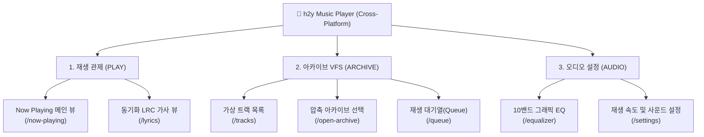

# 05. 메뉴및화면설계서 (Menu & UI Specification)

> **상세설계 정의서**: 시스템의 정보 구조(Information Architecture, IA)인 메뉴 트리와 권한별 라우팅을 정의하고, 사용자 접점이 되는 전수 화면/팝업의 레이아웃, 와이어프레임(Wireframe), 그리드/폼 명세 및 UI 디자인 시스템 표준을 종합 설계합니다.

---

## 1. 메뉴 구조도 (Information Architecture, IA)



---

## 2. 전수 메뉴 및 라우팅/권한 명세표 (FORM-05-01)

| 1Depth (GNB) | 2Depth (LNB/Tab) | 3Depth (서브/모달) | 메뉴 ID (MENU-ID) | 연결 화면 ID (PAGE-ID) | 프론트엔드 라우팅 URL (Flutter Route) | 접근 권한 | 사용 여부 |
| :--- | :--- | :--- | :---: | :---: | :--- | :---: | :---: |
| **플레이어** | Now Playing | - | `MENU-PLAY-01` | `PAGE-PLAY-01` | `/now-playing` | 전체 사용자 | **사용** |
| **플레이어** | 가사 뷰어 | 동기화 LRC 가사 | `MENU-PLAY-02` | `PAGE-LYRICS-01` | `/lyrics` | 전체 사용자 | **사용** |
| **보관함** | 트랙 목록 | 음원 검색 및 필터 | `MENU-ARCHIVE-01` | `PAGE-TRACK-01` | `/tracks` | 전체 사용자 | **사용** |
| **보관함** | 아카이브 열기 | 파일 탐색기 선택 | `MENU-ARCHIVE-02` | `POPUP-PICKER-01` | `/open-archive` | 전체 사용자 | **사용** |
| **보관함** | 재생 대기열 | 스마트 셔플/반복 | `MENU-ARCHIVE-03` | `PAGE-QUEUE-01` | `/queue` | 전체 사용자 | **사용** |
| **오디오 DSP** | 이퀄라이저 | 10밴드 EQ 프리셋 | `MENU-AUDIO-01` | `POPUP-EQ-01` | `/equalizer` | 전체 사용자 | **사용** |
| **설정** | 환경설정 | 테마/버전 정보 | `MENU-SET-01` | `PAGE-SET-01` | `/settings` | 전체 사용자 | **사용** |

---

## 3. 화면(Page) 및 팝업(Popup) 마스터 목록표

### 3.1 화면(Page) 마스터 목록 (FORM-05-02)

| 도메인/모듈 | 화면 ID (PAGE-ID) | 화면명 (Page Name) | 프로토타입 HTML 파일 | 프론트엔드 소스 경로 (Flutter) | 연결 메뉴 ID | 주요 연동 API / 프로바이더 | 비고 |
| :---: | :---: | :--- | :--- | :--- | :---: | :--- | :--- |
| `UI` | `PAGE-SHELL-01` | 메인 반응형 셸 | [PAGE-PLAY-01.html](./prototype/PAGE-PLAY-01.html) | `lib/views/app_shell_view.dart` | - | `PackageInfo`, `VfsProvider` | 스마트폰 탭 / 태블릿 2단 |
| `UI` | `PAGE-PLAY-01` | Now Playing 바이닐 뷰 | [PAGE-PLAY-01.html](./prototype/PAGE-PLAY-01.html) | `lib/views/widgets/vinyl_visualizer.dart` | `MENU-PLAY-01` | `PlayerProvider`, `just_audio` | 120Hz 회전 LP & 스펙트럼 |
| `UI` | `PAGE-TRACK-01` | VFS 트랙 목록 뷰 | [PAGE-TRACK-01.html](./prototype/PAGE-TRACK-01.html) | `lib/views/widgets/track_list_view.dart` | `MENU-ARCHIVE-01` | `VfsProvider.filteredTracks` | 초고속 실시간 트랙 검색 |
| `UI` | `PAGE-LYRICS-01` | 실시간 동기화 가사 뷰 | [PAGE-LYRICS-01.html](./prototype/PAGE-LYRICS-01.html) | `lib/views/widgets/lyrics_view.dart` | `MENU-PLAY-02` | `VfsProvider`, `LrcParser` | 타임스탬프 하이라이트 & 시크 |
| `UI` | `PAGE-EQ-01` | 10밴드 그래픽 EQ 뷰 | [PAGE-EQ-01.html](./prototype/PAGE-EQ-01.html) | `lib/views/widgets/equalizer_dialog.dart` | `MENU-AUDIO-01` | `PlayerProvider`, `AudioEqualizer` | 32Hz~16kHz 페이더 & 프리셋 |
| `UI` | `PAGE-MINI-01` | 하단 플로팅 플레이어 바 | [PAGE-PLAY-01.html](./prototype/PAGE-PLAY-01.html) | `lib/views/widgets/mini_player_bar.dart` | `MENU-PLAY-01` | `PlayerProvider.togglePlay` | 슬림 프로그레스 & Hero 컨트롤 |

### 3.2 팝업(Popup) 마스터 목록 (FORM-05-03)

| 도메인/모듈 | 팝업 ID (POPUP-ID) | 팝업명 (Popup Name) | 소스 경로 (Flutter) | 호출 화면 ID (Caller) | 모달 유형 | 비고 |
| :---: | :---: | :--- | :--- | :---: | :---: | :--- |
| `ARCHIVE` | `POPUP-PICKER-01` | 아카이브 파일 선택 다이얼로그 | `lib/views/widgets/drop_zone_card.dart` | `PAGE-SHELL-01` | 시스템 파일 선택기 (`file_picker`) | ZIP, 7Z, RAR, TAR 선택 |
| `AUDIO` | `POPUP-EQ-01` | 10밴드 그래픽 EQ 모달 | `lib/views/widgets/equalizer_dialog.dart` | `PAGE-PLAY-01` | 바텀시트 (Modal BottomSheet) | 32Hz~16kHz 게인 조절 |

---

## 4. UI 디자인 시스템 & 멀티 테마 명세표 (FORM-05-04)

| 구분 | 표준 규격 / 테마명 | 배경색 (Background) | 카드/서피스 (Surface) | 텍스트 (Text) | 포인트 컬러 (Accent) | 테마 성격 및 설명 |
| :---: | :--- | :---: | :---: | :---: | :---: | :--- |
| `1` | `⚡ Cyber Neon (사이버 다크 ⭐)` | `#030712` (Void Black) | `#0B0F19` (Glass Base) | `#F9FAFB` (Snow White) | `#00F0FF` (Cyan) / `#A855F7` (Purple) | **기본 다크 테마**: 네온 사이버펑크 120Hz 오디오 감성 |
| `2` | `☀️ Clean Slate (모던 라이트)` | `#F8FAFC` (Slate Light) | `#FFFFFF` (Pure White) | `#0F172A` (Slate Dark) | `#0284C7` (Sky Blue) / `#6366F1` (Indigo) | **엔터프라이즈 라이트**: 주간 야외 고시인성 UI |
| `3` | `🌿 Deep Emerald (친환경 에코)` | `#02140D` (Emerald Dark) | `#06281B` (Moss Surface) | `#ECFDF5` (Mint White) | `#10B981` (Emerald) / `#34D399` (Mint) | **에코 그린**: 유기적이고 차분한 네이처 감성 |
| `4` | `🌌 Midnight Purple (미드나잇)` | `#090414` (Deep Purple) | `#150B2C` (Velvet Card) | `#FAF5FF` (Soft Lavender) | `#C084FC` (Neon Violet) / `#F43F5E` (Rose) | **심야 바이올렛**: 몽환적인 R&B / Synthwave 무드 |
| `5` | `🔥 Sunset Amber (골드 에너지)` | `#120902` (Amber Dark) | `#241205` (Bronze Card) | `#FFFBEB` (Warm White) | `#F59E0B` (Amber Gold) / `#EF4444` (Flame) | **선셋 앰버**: 따뜻하고 아날로그적인 빈티지 LP 감성 |

---

## 5. 화면별 상세 레이아웃 & 와이어프레임 명세

### 5.1 PAGE-SHELL-01: 메인 셸 & 슬림 드롭존 & 하단 미니 플레이어 바
```text
┌────────────────────────────────────────────────────────────────────────┐
│ [헤더] ⚡ h2y Music Player  [v0.0.1]      ZIP 무해제 스트리밍 ● VFS Ready│
├────────────────────────────────────────────────────────────────────────┤
│ [드롭존] [📦 ZIP] 앨범_FLAC_Archive.zip (트랙 24개, 18ms)       [파일변경]│
├────────────────────────────────────────────────────────────────────────┤
│ [탭 전환]  [ 🎵 Now Playing (선택됨) ]    [ 📜 Track List (24) ]       │
├────────────────────────────────────────────────────────────────────────┤
│                                                                        │
│                      [ 메인 콘텐츠 영역 (Expanded) ]                   │
│                                                                        │
├────────────────────────────────────────────────────────────────────────┤
│ [미니바] [🎵 커버] Track 01 - Cyberpunk Anthem    [⏮ 34]  [▶ 62]  [⏭ 34]│
│          01:24 ━━━━━━━━━━━━●━━━━━━━━━━━━━━━━━━━━━━━━━━━━ 04:15         │
└────────────────────────────────────────────────────────────────────────┘
```

### 5.2 PAGE-PLAY-01: Now Playing 바이닐 & 스펙트럼 비주얼라이저
```text
┌────────────────────────────────────────────────────────────────────────┐
│                                                                        │
│                         ╭──────────────────╮                           │
│                         │   ╭──────────╮   │                           │
│                         │   │  ( 🎵 )  │   │  [ 120Hz 회전 바이닐 LP ] │
│                         │   ╰──────────╯   │                           │
│                         ╰──────────────────╯                           │
│                                                                        │
│                       Track 01. Cyber City Night                       │
│                        Electronic / FLAC 24-bit                        │
│             [ FLAC ]    [ Offset 0x004A20 ]    [ 42.8 MB ]             │
│                                                                        │
│              ▂▃▅▆▇█▇▆▅▃▂ ▂▃▅▆▇█▇▆▅▃▂  [실시간 오디오 스펙트럼]          │
│                                                                        │
└────────────────────────────────────────────────────────────────────────┘
```

### 5.3 PAGE-TRACK-01: VFS 가상 트랙 목록 & 검색
```text
┌────────────────────────────────────────────────────────────────────────┐
│ [검색바] 🔍 트랙명, 아티스트, 확장자 검색...                [FLAC 8개 ▼]│
├────────────────────────────────────────────────────────────────────────┤
│ [트랙 01] 🎵 Track 01. Cyber City Night.flac              42.8 MB [재생]│
│ [트랙 02] 🎵 Track 02. Neon Highway.mp3                   11.2 MB [대기]│
│ [트랙 03] 🎵 Track 03. Midnight Rain.flac                  38.5 MB [대기]│
│ [트랙 04] 🎵 Track 04. Future Nostalgia.wav               55.1 MB [대기]│
│ [트랙 05] 🎵 Track 05. Digital Love.flac                  40.2 MB [대기]│
└────────────────────────────────────────────────────────────────────────┘
```

---

## 6. 문서 공통 변경 이력 표 (FORM-08-07)

| 버전 | 일자 | 변경 내용 | 작성자 |
| :---: | :---: | :--- | :---: |
| `v1.0` | 2026-09-01 | 초판 제정: IA 메뉴 구조도, 전수 화면/팝업 명세, 5대 멀티 테마 디자인 시스템 및 와이어프레임 설계 | 모바일 UI/UX팀 |
