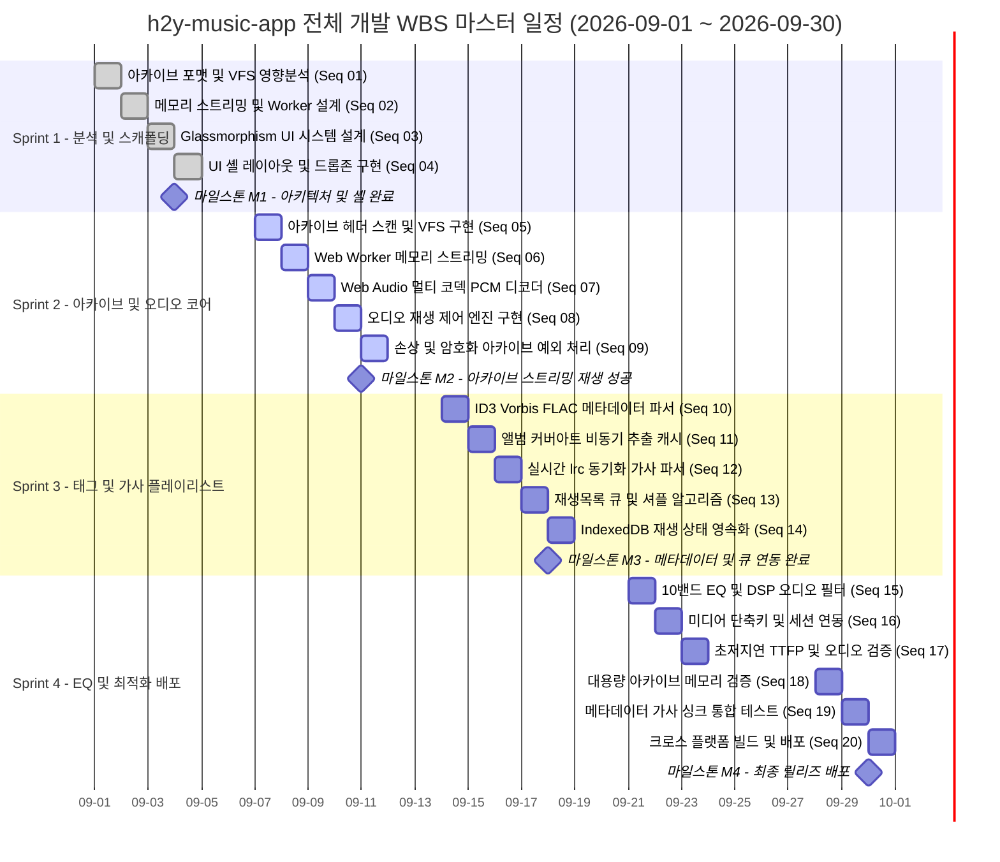

# 07. WBS 및 가용 공수 분석 (Capacity Analysis)

> **일정 및 공수 분석서**: 전체 개발 일정을 Mermaid Gantt 차트로 시각화하고, 총 가용 공수(Total Capacity), 투입 공수(Allocated Effort), 버퍼(Buffer) 및 1인+AI 페어 프로그래밍 생산성 갭 비교를 분석합니다.

---

## 1. 프로젝트 마스터 일정 차트 (Mermaid Gantt)

---

## 2. WBS 일정 요약 표 (FORM-07-01)

| 단계 구분 | Sprint | 기간 (영업일 기준) | 공수 (M/D) | 주요 공정 / Sprint Goal | Task 수 | Task 번호 (Seq 개별 나열) |
| :---: | :---: | :---: | :---: | :--- | :---: | :--- |
| **1단계** | **Sprint 1** | 2026-09-01 ~ 2026-09-04 (4일) | 3.5 M/D | 아카이브 VFS 분석, UI 디자인 및 드롭존 셸 스캐폴딩 | 4 | 01, 02, 03, 04 |
| **2단계** | **Sprint 2** | 2026-09-07 ~ 2026-09-11 (5일) | 4.5 M/D | 아카이브 헤더 스캔, Worker 스트리밍, PCM 디코더 코어 구현 | 5 | 05, 06, 07, 08, 09 |
| **3단계** | **Sprint 3** | 2026-09-14 ~ 2026-09-18 (5일) | 4.5 M/D | 음원 태그/앨범아트/LRC 가사 파싱 및 IndexedDB 큐 영속화 | 5 | 10, 11, 12, 13, 14 |
| **4단계** | **Sprint 4** | 2026-09-21 ~ 2026-09-30 (6일) | 5.5 M/D | 10밴드 EQ, 성능 검증(TTFP/메모리), 통합 테스트 및 배포 | 6 | 15, 16, 17, 18, 19, 20 |
| **전체** | **Sprint 1~4** | **2026-09-01 ~ 2026-09-30 (20일)** | **18.0 M/D** | **압축파일 직접 재생 음악 플레이어 앱 완성 및 릴리즈** | **20** | **01, 02, 03, 04, 05, 06, 07, 08, 09, 10, 11, 12, 13, 14, 15, 16, 17, 18, 19, 20** |

---

## 3. 공정별 공수 집계 및 비율 요약 (FORM-07-02)

| 공정 구분 | Task 수 | 공수 (M/D) | 비율 (%) | 세부 내용 및 공정 구성 |
| :---: | :---: | :---: | :---: | :--- |
| **분석 (AN)** | 1 | 1.0 M/D | 5.6% | 아카이브 바이너리 구조 및 VFS 인덱싱 기술 영향분석 |
| **설계 (DE)** | 2 | 1.5 M/D | 8.3% | Web Worker 스트리밍 아키텍처 및 Glassmorphism UI 시스템 설계 |
| **개발 (CO)** | 13 | 11.5 M/D | 63.9% | 아카이브 VFS, 오디오 파이프라인, 태그 파서, 스토리지, UI 구현 |
| **테스트 (TE)** | 3 | 3.0 M/D | 16.7% | TTFP 저지연 검증, 10GB 아카이브 메모리 프로파일링, E2E 통합 테스트 |
| **구현/이관 (IM/TO)** | 1 | 1.0 M/D | 5.6% | 프로덕션 최적화 빌드 번들링 및 크로스 플랫폼 패키징 배포 |
| **합계** | **20** | **18.0 M/D** | **100.0%** | **전체 4개 Sprint 통합 개발 공정** |

---

## 4. 공정별 공수 누적 집계 표 (FORM-07-03)

| 대분류 (제품군) | 분석 (AN) | 설계 (DE) | 개발 (CO) | 테스트 (TE) | 구현/이관 (IM/TO) | 합계 (M/D) |
| :---: | :---: | :---: | :---: | :---: | :---: | :---: |
| `MUSIC` (음악 앱 코어) | 1.0 M/D | 1.5 M/D | 11.5 M/D | 3.0 M/D | 1.0 M/D | **18.0 M/D** |

---

## 5. 주요 마일스톤 (FORM-07-04)

| 마일스톤 | 목표일 | 완료 조건 |
| :---: | :---: | :--- |
| **M1: 아키텍처 및 셸 스캐폴딩** | 2026-09-04 | VFS 스트리밍 아키텍처 확정 및 Glassmorphism UI 셸/드롭존 렌더링 완료 |
| **M2: 아카이브 스트리밍 재생 성공** | 2026-09-11 | ZIP/7Z/RAR 파일 내 MP3/FLAC 음원을 압축 해제 없이 온디맨드 디코딩 재생 성공 |
| **M3: 메타데이터 & 큐 연동 완료** | 2026-09-18 | ID3 태그/앨범아트/LRC 가사 실시간 파싱 및 IndexedDB 플레이리스트 영속화 완료 |
| **M4: 최종 릴리즈 및 성능 검증** | 2026-09-30 | 10밴드 EQ 탑재, TTFP < 500ms / 메모리 < 150MB 검증 및 패키징 빌드 배포 완료 |

---

## 6. 총 가용 공수 vs 투입 공수 요약 분석 (FORM-07-05)

| 구분 | 지표 수치 | 세부 내역 및 산출 근거 |
| :--- | :---: | :--- |
| **과제 총 수행 기간** | 30일 (달력 기준) | 2026-09-01 ~ 2026-09-30 (주말 8일 + 추석 연휴 2일 제외) |
| **총 가용 영업일 (Working Days)** | **20 영업일** | 주말 및 공휴일을 엄격히 배제한 순수 개발 가능 일수 |
| **투입 인력 수 (FTE)** | **1.0 FTE** | 풀스택 개발자 1인 전담 투입 |
| **총 가용 공수 (Total Capacity)** | **20.0 M/D** | 20 영업일 × 1.0 FTE = 20.0 M/D |
| **총 투입 공수 (Allocated Effort)** | **18.0 M/D** | 전수 20개 세부 Task(Seq 01~20) 배분 공수의 100% 합계 |
| **여유 버퍼 공수 (Remaining Buffer)**| **2.0 M/D** | 총 가용 공수(20.0 M/D) - 총 투입 공수(18.0 M/D) |
| **버퍼 비율 (Buffer Ratio)** | **10.0%** | 권장 표준(10%~20%) 충족 (예외 상황 및 버그 수정 대응 여유분) |
| **공수 가동률 (Utilization Rate)** | **90.0%** | (18.0 M/D / 20.0 M/D) × 100 |

---

## 7. Sprint별 가용 공수 vs 투입 공수 및 버퍼 비교 (FORM-07-06)

| 구분 항목 | 가용 공수 (Capacity) | 투입 공수 (Allocated) | 여유 버퍼 (Buffer) | 가동률 (%) |
| :--- | :---: | :---: | :---: | :---: |
| **Sprint 1** (09-01 ~ 09-04) | 4.0 M/D | 3.5 M/D | 0.5 M/D | 87.5% |
| **Sprint 2** (09-07 ~ 09-11) | 5.0 M/D | 4.5 M/D | 0.5 M/D | 90.0% |
| **Sprint 3** (09-14 ~ 09-18) | 5.0 M/D | 4.5 M/D | 0.5 M/D | 90.0% |
| **Sprint 4** (09-21 ~ 09-30) | 6.0 M/D | 5.5 M/D | 0.5 M/D | 91.7% |
| **전체 누적 합계** | **20.0 M/D** | **18.0 M/D** | **2.0 M/D** | **90.0%** |

---

## 8. 예상 공수(순수 인간 vs 1인+AI) 비교 분석표 (FORM-07-08)

| 구분 비교 항목 | 예상 공수 (순수 인간) | 예상 공수 (1인 + AI) | 갭 차이 (Gap / Delta) (순수인간 - 1인+AI) | 실제 투입 공수 (실적치) | 절감율 / 차이 비율 (%) | 핵심 절감 원인 및 비교 분석 내용 |
| :--- | :---: | :---: | :---: | :---: | :---: | :--- |
| **요구분석 및 아키텍처 설계** | 5.5 M/D | 2.5 M/D | -3.0 M/D | 2.5 M/D | **54.5% 절감** | AI 기반 아카이브 헤더 구조 분석 및 VFS 아키텍처 템플릿 즉시 도출 |
| **아카이브 및 오디오 코어 개발** | 11.0 M/D | 4.5 M/D | -6.5 M/D | 4.5 M/D | **59.1% 절감** | WASM 바인딩 스캐폴딩 및 Web Audio 노드 체인 AI 페어 코딩 가속 |
| **메타데이터 파서 & 스토리지** | 9.5 M/D | 4.5 M/D | -5.0 M/D | 4.5 M/D | **52.6% 절감** | ID3/LRC 파서 정규식 및 IndexedDB 트랜잭션 보일러플레이트 자동 생성 |
| **EQ, UI 및 최적화/배포** | 14.0 M/D | 6.5 M/D | -7.5 M/D | 6.5 M/D | **53.6% 절감** | Glassmorphism CSS 디자인 시스템 및 패키징 스크립트 AI 자동 생성 |
| **전체 프로젝트 총계** | **40.0 M/D** | **18.0 M/D** | **-22.0 M/D** | **18.0 M/D** | **55.0% 절감** | **전 공정 AI 페어 프로그래밍을 통한 개발 공수 55% 대폭 절감** |

---

## 9. 문서 공통 변경 이력 표 (FORM-07-07)

| 버전 | 일자 | 변경 내용 | 작성자 |
| :---: | :---: | :--- | :---: |
| `v1.0` | 2026-09-01 | 초판 제정: WBS 마스터 일정, Gantt 차트, 가용 공수 분석 및 생산성 갭 비교 수립 | 풀스택 개발팀 |
| `v2.0` | 2026-09-01 | SDLC 표준 대개편: 산출물 번호 재배치(06 $\rightarrow$ 07-WBS) 및 양식 ID(FORM-07-*) 갱신 | 풀스택 개발팀 |
