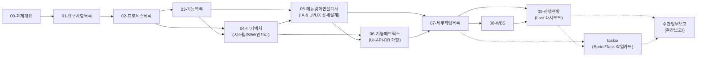
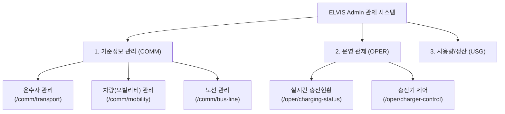

# 산출물 문서작성 체계

> 과제 산출물은 소프트웨어공학(SDLC) 표준에 따라 **분석(01~03) $\rightarrow$ 상위설계(04) $\rightarrow$ 상세설계(05~06) $\rightarrow$ 공정/일정관리(07~09)** 순으로 구성하며, 아래 **00~09 순번 및 산출물명**을 표준 파일명으로 적용한다.

---

## 산출물 목록

| 순번 | 산출물명          | 파일명                   |  단계 구분   | 핵심 역할                                                                |
| :--: | :---------------- | :----------------------- | :----------: | :----------------------------------------------------------------------- |
|  00  | 과제개요          | `00-과제개요.md`         |     착수     | 과제 배경, 전체 일정, 산출물 연동도 및 약어 정의                         |
|  01  | 요구사항목록      | `01-요구사항목록.md`     |     분석     | 기능/비기능 요구사항 마스터 정의서 (SRS)                                 |
|  02  | 프로세스목록      | `02-프로세스목록.md`     |     분석     | 비즈니스 업무 흐름 및 시퀀스 다이어그램                                  |
|  03  | 기능목록          | `03-기능목록.md`         |     분석     | 모듈별 전수 기능 마스터 정의 (Feature List)                              |
|  04  | 아키텍처          | `04-아키텍처.md`         | **상위설계** | **시스템/소프트웨어/인프라/데이터 파이프라인 아키텍처**                  |
|  05  | 메뉴및화면설계서  | `05-메뉴및화면설계서.md` | **상세설계** | **메뉴 구조(IA), 화면/팝업 와이어프레임, 그리드/폼 명세, 디자인 시스템** |
|  ⭐  | **UI 프로토타입** | **`prototype/` 폴더**    | **상세설계** | **화면 ID별(`PAGE-ID.html`) 독립 웹 프로토타입 & 멀티 테마**             |
|  06  | 기능매트릭스      | `06-기능매트릭스.md`     |   상세설계   | UI-API-DB 연동 및 CRUD/변경영향도 매트릭스                               |
|  07  | 세부작업목록      | `07-세부작업목록.md`     |   공정관리   | WBS-ID 기반 전수 세부 Task 명세 및 M/D 공수 산정                         |
|  08  | WBS               | `08-WBS.md`              |   일정관리   | Gantt 차트, 총 가용 공수(Capacity) 분석 및 마일스톤                      |
|  09  | 진행현황          | `09-진행현황.md`         |   진척관리   | 전수 세부작업 진행 관리 대장 및 실시간 대시보드                          |
|  ⭐  | **세부작업카드**  | **`tasks/` 폴더**        | **상세구현** | **Sprint/Task별 DTO, SQL, 체크리스트 작업 카드**                         |

---

## ID 명명 체계 표준 (공통 규칙)

### 1. 요구사항 ID (REQ-ID)

- 형식: `REQ-[NNN]` (예: `REQ-001`)
- 구분: 기능적 요구사항(신규/수정), 비기능적 요구사항(성능, 보안, 운영 등) 전체에 일련번호 부여

### 2. 프로세스 ID (PROC-ID)

- 형식: `PROC-[NN]` (예: `PROC-01`)
- 비즈니스 및 처리 흐름 단위로 정의하며, 각 흐름별 Mermaid 시퀀스/플로우 다이어그램 필수 포함

### 3. 기능 ID (FUNC-ID)

- 형식: `FUNC-[영역/모듈]-[NNN]` (예: `FUNC-WS-101`, `FUNC-UI-001`)
- 프론트엔드(UI), 백엔드(API), 데이터베이스(DB), 배치(BATCH) 등 영역 또는 모듈별로 명명

### 4. 메뉴 및 화면 ID (MENU-ID / PAGE-ID / POPUP-ID)

- **메뉴 ID**: `MENU-[대분류]-[NN]` (예: `MENU-STD-01`, `MENU-OPER-01`)
- **화면 ID**: `PAGE-[도메인/모듈]-[NN]` (예: `PAGE-TRANSPORT-01`, `PAGE-MOBILITY-01`)
- **팝업 ID**: `POPUP-[도메인/모듈]-[NN]` (예: `POPUP-TRANSPORT-01`, `POPUP-MOBILITY-BULK-01`)
- **공통 컴포넌트 ID**: `COMP-[유형]-[NN]` (예: `COMP-GRID-01`, `COMP-SEARCH-01`)

### 5. WBS 작업 ID (WBS-ID)

- 형식: `WBS-[제품군/대분류]-[모듈/중분류]-[기능ID]-[공정단계]` (예: `WBS-CONNECT-WS-101-CO`, `WBS-MOBILITY-ANL-001-AN`)
- **공정단계 코드 (2자리 영문 대문자 표준)**:
  - `PP`: Project Preparation : 프로젝트 준비
  - `AN`: Analysis: 요구사항 분석 및 영향분석
  - `DE`: Design: 아키텍처, ERD, DTO, 화면/DB 설계
  - `CO`: Coding & Development: 구현, 개발 및 SQL 개편
  - `TE`: Testing & Verification: 단위 및 통합 테스트, 검증
  - `IM`: Implementation : 구현
  - `TO`: Turn-over: 운영 이관

### 6. 양식 ID (FORM-ID)

- 형식: `FORM-[산출물번호]-[NN]` (예: `FORM-00-01`, `FORM-04-01`, `FORM-05-01`, `FORM-07-02`, `FORM-09-02`)
- 구분: 각 산출물 문서에서 사용하는 테이블 헤더의 표준 양식(Form) 고유 ID.

### 7. 문서 버전 규칙 (Document Versioning)

- **형식**: `v[X].[Y]` (예: `v1.0`, `v1.1`)
  - `X` (Major): 최초 배포(`v1.0`) 및 산출물 전체 구조의 중대 변경 시 업 버전.
  - `Y` (Minor): 기능 추가, 일부 테이블 값 보정, 일정 단순 변경 시 소수점 업 버전.
- **변경 이력 기록**: 모든 산출물의 변경 내용은 해당 문서 최하단의 **변경 이력 표**에 필수 수록 및 동기화.

### 8. 표준 모듈 코드 정의

모든 과제 내 모듈 구분은 아래 대문자 코드로 표준화하여 사용합니다:

- `WS`: 웹소켓 연결 게이트웨이 및 소켓 핸들러 영역
- `SYNC`: 컨슈머, 전문 파싱, DB 비동기/동기 적재 엔진 영역
- `DATA`: 시계열/빅데이터 OLAP 엔진 영역
- `API`: 어드민 백엔드 포털, REST API 및 알림 푸시 영역
- `UI`: 프론트엔드 관제 웹 화면 및 UI 영역
- `DB`/`MAP`: MyBatis Mapper XML 및 데이터베이스 쿼리/DDL 영역
- `SIM`: 충전기 부하 시뮬레이터 영역
- `PKG`: 단일 인스톨러 패키징 영역
- `DEP`/`TST`: 통합 테스트 및 배포/이관 공정 영역

### 9. 리스크 및 이슈 ID (RISK-ID / ISSUE-ID)

- 형식: `RISK-[NN]` (예: `RISK-01`), `ISSUE-[NN]` (예: `ISSUE-01`)
- 구분: 프로젝트 수행 중 식별된 기술, 일정, 성능, 데이터 리스크 및 장애/이슈 사항에 일련번호 부여

### 10. 마일스톤 ID (M-ID)

- 형식: `M[N]` (예: `M1`, `M2`, `M3`)
- 구분: 프로젝트 공정 및 Sprint 완료 시점별 검증 기준점 및 핵심 성과 마일스톤 번호

### 11. 다중 ID 테이블 표기 및 줄바꿈 표준 (Multi-ID Table Formatting Rule)

테이블 셀 내에 다수의 ID(요구사항 ID, 기능 ID, WBS ID 등)를 나열할 때 가독성과 데이터 무결성을 동시에 보장하기 위한 공통 표기 규칙입니다:

1. **전수 명시 원칙**:
   - 다수의 ID가 매핑되는 경우(예: 통합 테스트, 전체 이관 등), 임의로 축약하거나 생략하지 않고 **전수 ID를 빠짐없이 명시**합니다.
2. **줄바꿈(`<br>`) 블록 정렬**:
   - 테이블 가로 폭이 과도하게 늘어나 문서 레이아웃이 깨지는 것을 방지하기 위해, 한 줄당 **5~7개 단위**로 `<br>` 태그를 사용하여 균형 있게 줄바꿈 처리합니다.
3. **표준 예시**:
   ```markdown
   `REQ-001`, `REQ-002`, `REQ-003`, `REQ-004`, `REQ-005`, `REQ-006`, `REQ-007`<br>`REQ-008`, `REQ-009`, `REQ-010`, `REQ-011`, `REQ-012`, `REQ-013`, `REQ-014`<br>`REQ-015`, `REQ-016`, `REQ-017`, `REQ-018`, `REQ-019`, `REQ-020`, `REQ-021`<br>`REQ-022`, `REQ-023`, `REQ-024`, `REQ-025`, `REQ-026`, `REQ-027`, `REQ-028`<br>`REQ-029`, `REQ-030`, `REQ-031`, `REQ-032`, `REQ-033`, `REQ-034`, `REQ-035`
   ```

---

## 산출물별 작성 가이드

### 00. 과제개요

> **목적**: 과제 전체 개요, 추진 일정 마스터 플랜 및 산출물 관계도를 총괄 명세한다.

**주요 포함 내용**

1. 과제 기본 정보 (ID, 과제명, 기간, 담당자, 개발 방법론, 변경사항 등 메타 정보 표)
2. 과제 배경 및 기대 효과
3. 과제 범위 및 아웃라인 (주요 요건 요약)
4. 과제 산출물 목록 및 역할 표 (번호 / 파일명 / 역할 / 형식 / 승인 상태)
5. 문서 간 데이터 흐름 및 활용 가이드
6. 주요 약어 정의 (Acronyms) 및 명명 표준 기술

**작성 기준**

- 모든 산출물의 총괄 마스터 문서이므로 **가장 먼저 작성**
- 00~09 전체 파일에 대한 상대 경로 링크 및 역할 기술
- 산출물 간 데이터 흐름이 시각적으로 명확히 보이도록 **다이어그램 필수**

#### 💡 테이블 헤더 구성 표준

- `FORM-00-01`: **산출물 목록 및 역할 표 헤더**
  `| 순번 | 산출물 구분 | 문서 파일 링크 | 핵심 역할 및 수검 검증 범위 | 관리 상태 |`
- `FORM-00-02`: **WBS ID 약어 해설 표 헤더**
  `| WBS ID 요소 | 구성 코드 | 풀스펠링 (Full English Name) | 한글 기능 풀이 설명 |`
- `FORM-00-03`: **약어 정의 표 헤더 (Acronyms)**
  `| 약어 (Acronym) | 정식 영어 표현 (Full English Name) | 한글 뜻 및 역할 설명 |`
- `FORM-00-04`: **문서 간 상호 연동 매트릭스 표 헤더**
  `| 검증 영역 | 참조 문서 1 | 참조 문서 2 | 비고 |`
- `FORM-00-05`: **과제 기본 정보 표 헤더**
  `| 항목 | 내용 |`
  - 필수 항목: 과제 ID, 과제명, 과제 구분, 수행 기간, **개발 방법론** (`Sprint(애자일)` / `Phase(폭포수)`), 주요 이해관계자, 주요 변경 사항

#### 💡 산출물 간 데이터 흐름 표준 다이어그램 (Mermaid Flowchart)



---

### 01. 요구사항목록

> **목적**: 시스템이 충족해야 할 기능적·비기능적 요구사항을 체계적으로 정의하고 추적 가능하게 관리한다.

**주요 포함 내용**

1. 요구사항 검증 개요 (목표, 수용률, 중요 지표)
2. 요구사항 마스터 명세 테이블 (ID, 대분류, 관련 모듈, 요구사항명, 상세 설명, 중요도, 상태)
3. 요구사항-기능-WBS ID 추적성 매핑 레지스트리

**작성 기준**

- `REQ-번호` 체계로 **고유 식별자 부여**
- 각 요구사항에 관련 기능 ID (`FUNC-`) 및 WBS 작업 ID를 매핑하여 상호 추적성 확보
- 성능, 보안, 이관 등 비기능적 요건(NFR) 누락 없이 기술

#### 💡 테이블 헤더 구성 표준

- `FORM-01-01`: **요구사항 마스터 명세 테이블 헤더**
  `| 요구사항 ID | 대분류 | 관련 모듈 ID | 요구사항명 | 상세 설명 | 중요도 | 상태 | 수용여부 |`
- `FORM-01-02`: **요구사항 ↔ WBS 작업 ID 추적성 매트릭스 헤더**
  `| 요구사항 ID | 관련 기능 ID | 매핑 WBS 작업 ID 범위 (Task Range) | 주요 검증 내용 |`
- `FORM-01-03`: **문서 마스터 연동 체계 헤더**
  `| 구분 | 참조 문서 | 주요 연동 및 검증 내용 |`

---

### 02. 프로세스목록

> **목적**: 과제와 관련된 주요 비즈니스 프로세스를 흐름 중심으로 정의하여 업무 처리 순서와 시스템 연계를 명확히 한다.

**주요 포함 내용**

1. 프로세스 목록 요약 (ID, 프로세스명, 분류, 관련 기능 수)
2. 프로세스 상세 흐름도 (Mermaid Sequence/Flowchart)
3. 단계별 액터, 컴포넌트, 시스템 간 상세 인터랙션 명세
4. 단계별 관련 기능 ID 및 DB/API 매핑 정보

**작성 기준**

- 각 프로세스는 **흐름도(Mermaid) 필수** 작성
- 액터(Actor)부터 백엔드, DB, 외부 연동까지의 전체 데이터 흐름 명시
- 데이터베이스 적재 형태(OLTP/OLAP) 및 비동기 메시징 흐름 포함 시 상세 표기

#### 💡 테이블 헤더 구성 표준

- `FORM-02-01`: **프로세스 목록 요약 표 헤더**
  `| 프로세스 ID | 프로세스명 | 대분류 | 관련 기능 수 |`
- `FORM-02-02`: **프로세스 단계 표 헤더**
  `| 단계 | 단계명 | 설명 | 관련 기능 ID |`
- `FORM-02-03`: **프로세스 ↔ 시스템 연동 영향도 헤더**
  `| 단계 | 단계명 | 설명 | 관련 서브모듈 / SQL ID |`
- `FORM-02-04`: **시연 및 정산 예시 표 헤더**
  `| 세션 구분 | 타임스탬프 (Timestamp) | 누적 미터값 (MeterValue) | 차이 전력량 (kWh) | 적용 계절/부하 구분 | 적용 단가 (원/kWh) | 정산 금액 (원) |`
- `FORM-02-05`: **관련 문서 체계 표 헤더**
  `| 구분 | 문서명 | 설명 |`

---

### 03. 기능목록

> **목적**: 개발 대상 기능을 대/중/소분류 체계로 분류하고 기능 ID를 부여하여 전체 개발 범위를 정의한다.

**주요 포함 내용**

1. 기능 분류 체계 요약 표 (대분류 / 중분류 / 신규 수 / 수정 수)
2. 제품군/모듈별 기능 목록 정의서 (화면, API, DB 테이블, 기존 SQL 영향)

**작성 기준**

- 기능 ID 체계: `FUNC-` 패턴 적용
- 대/중분류 기준으로 그룹화하여 가독성 확보
- 요구사항(`01-요구사항목록`) 및 프로세스(`02-프로세스목록`)에 매핑되는 세부 기능을 빠짐없이 도출

#### 💡 테이블 헤더 구성 표준

- `FORM-03-01`: **제품군/모듈별 기능 요약 표 헤더**
  `| 대분류 (제품군) | 중분류 (모듈) | 기능 ID 범위 | 세부 기능 수 | 핵심 역할 및 수검 범위 |`
- `FORM-03-02`: **세부 기능 목록 표 헤더**
  `| 모듈 | 기능 ID | 기능 구분 | 기능명 (Feature) | 상세 기능 설명 |`

---

### 04. 아키텍처 (Architecture Specification)

> **목적**: 도출된 요구사항, 프로세스 및 기능을 기술적으로 실현하기 위한 시스템 구성도, 소프트웨어 레이어드 아키텍처, 데이터/메시징 파이프라인, 하드웨어 및 네트워크 인프라 사양을 종합 설계한다.

**주요 포함 내용**

1. **시스템 아키텍처 개요**: 시스템 목표, 설계 원칙 및 전체 시스템 구성도 (Mermaid 필수)
2. **소프트웨어 / 레이어드 아키텍처 명세**: Presentation, Application, Domain, Infrastructure 계층 분리 및 모듈별 책임
3. **데이터 및 메시징 파이프라인 아키텍처**: Kafka 토픽/파티셔닝 전략, CQRS(MySQL OLTP + ClickHouse OLAP) 하이브리드 저장소 구조
4. **하드웨어 및 인프라 사양 명세**: 서버 권장/여유 사양, 프로세스별 CPU/RAM 자원 배분, 물리 디스크 분리 구성안
5. **네트워크 포트 및 통신 인터페이스**: 방화벽 포트 개방 매핑, 프로토콜(WebSocket/HTTP/TCP) 정의
6. **보안 및 고가용성(HA/Resilience) 아키텍처**: JWT 인증 필터, 단말 인증, Kafka 장애 시 로컬 버퍼링 전환 매커니즘, DLT 재처리 전략

**작성 기준**

- 시스템 전체를 한눈에 조망할 수 있는 **Mermaid 시스템 아키텍처 다이어그램 필수** 포함
- 메시지 큐(Kafka), DB(OLTP/OLAP), 백엔드 서비스 간의 데이터 흐름 및 프로토콜 명시
- Standalone/분산 환경에 따른 자원 제어 및 프로세스 격리 방안 기술

#### 💡 테이블 헤더 구성 표준

- `FORM-04-01`: **핵심 소프트웨어 모듈 명세표 헤더**
  `| 상위 제품군 | 모듈명 (Module Name) | 대문자 풀명칭 (Code) | 주요 기술 스택 | 매핑 영역 | 핵심 역할 및 아키텍처 책임 |`
- `FORM-04-02`: **하드웨어 및 인프라 사양 명세 표 헤더**
  `| 구분 | 표준 권장 사양 (Standard Spec) | 여유 고성능 사양 (High-End Spec) | 비고 |`
- `FORM-04-03`: **자원 할당 명세 표 헤더 (프로세스별)**
  `| 구분 | 개별 프로세스 명칭 (Process Name) | CPU 코어 배분 | RAM 메모리 할당 | 디스크 용량 할당 | 자원 제어 및 OS/Windows 설정 가이드 |`
- `FORM-04-04`: **물리 디스크 분리 구성안 표 헤더**
  `| 드라이브 구분 | 디스크 용량 (1TB 표준 기준) | 디스크 용량 (2TB 고성능 기준) | 탑재 대상 프로세스 및 저장 폴더 | 디스크 I/O 성격 및 분리 효과 |`
- `FORM-04-05`: **네트워크 포트 및 통신 인터페이스 표 헤더**
  `| 구분 | 서비스/모듈명 | 프로토콜 | 포트번호 | 송신처 (Source) | 수신처 (Destination) | 용도 및 비고 |`
- `FORM-04-06`: **메시지 큐(Kafka) 토픽 설계 명세 표 헤더**
  `| 토픽명 (Topic Name) | 파티션 수 | 복제 계수 (Replication) | 보존 주기 (Retention) | 파티션 키 (Partition Key) | 주요 발행/구독 모듈 |`

---

### 05. 메뉴 및 화면설계서 (Menu & UI Specification)

> **목적**: 시스템의 정보 구조(Information Architecture, IA)인 메뉴 트리와 권한별 라우팅을 정의하고, 사용자 접점이 되는 전수 화면/팝업의 레이아웃, 와이어프레임(Wireframe), 그리드/폼 명세 및 UI 디자인 시스템 표준을 종합 설계한다.

**주요 포함 내용**

1. **메뉴 구조도 (Information Architecture, IA)**: LNB/GNB 메뉴 트리 구조 및 Mermaid 다이어그램
2. **전수 메뉴 및 권한/라우팅 매핑**: 메뉴 ID, 연결 화면 ID, 프론트엔드 라우팅 URL, 접근 권한 매핑 (`FORM-05-01`)
3. **화면 및 팝업 마스터 목록**: 메인 화면(Page) 및 모달 팝업(Popup) 식별자, 프로토타입 파일, 소스 파일 경로, 연동 API (`FORM-05-02`, `FORM-05-03`)
4. **UI 디자인 시스템 & 멀티 테마 표준**: 5대 프리셋 테마 규격, 기본 라이트 모드(`Clean Slate`), 타이포그래피, 컬러 팔레트 (`FORM-05-04`)
5. **화면별 상세 레이아웃 & 와이어프레임**: 텍스트 와이어프레임, 검색 조건, 그리드 컬럼 명세, 페이징, 폼 유효성 검증(Validation) 및 인터랙션 이벤트
6. **인터랙티브 웹 프로토타입 (`prototype/` 폴더)**: 화면 ID(`PAGE-ID.html`) 기준 독립 파일 분리 작성 표준

**작성 기준**

- LNB/GNB 메뉴 트리를 한눈에 볼 수 있는 **Mermaid 메뉴 구조 다이어그램 필수** 포함
- 화면 ID(`PAGE-ID`) 및 팝업 ID(`POPUP-ID`)는 표준 명명 규칙(`FORM-05-02`, `FORM-05-03`) 준수
- 프론트엔드 라우팅 경로(Vue Router / Flutter Route)와 백엔드 REST API 간의 매핑 명시
- 화면 레이아웃은 마크다운 텍스트 와이어프레임 또는 ASCII Box 형태로 직관적으로 기술

#### 💡 인터랙티브 UI 프로토타입 (`prototype/`) 작성 표준

1. **화면 ID별 독립 파일 분리 (`PAGE-[도메인]-[NN].html`)**:
   - 하나의 대형 단일 파일 대신, 각 화면 ID를 파일명으로 한 독립 실행형(Self-Contained) HTML 파일로 분리하여 관리합니다.
   - 예시: `PAGE-DASH-01.html`, `PAGE-CHG-01.html`, `PAGE-SESSION-01.html`, `PAGE-CDR-01.html`
2. **기본 진입점 파일 (`index.html`)**:
   - 프로토타입 폴더의 `index.html`은 기본 화면(`PAGE-DASH-01.html`)으로 자동 이동(Redirect) 및 포털 안내 허브 역할을 수행합니다.
3. **사이드바 LNB 메뉴 간 상호 라우팅**:
   - 좌측 메뉴 링크를 통해 각 `PAGE-ID.html` 파일 간을 자유롭게 상호 이동할 수 있도록 연결합니다.
4. **멀티 테마 시스템 표준**:
   - **기본(Default) 테마는 `☀️ Clean Slate (모던 엔터프라이즈 라이트)`**로 최초 로딩되도록 구성합니다.
   - 5대 테마 프리셋 지원:
     1. `☀️ Clean Slate (기본 라이트 ⭐)` : <span style="display:inline-block;width:20px;height:20px;background:#f1f5f9;border-radius:2px;border:1px solid #cbd5e1;vertical-align:middle;"></span> `#f1f5f9` 베이스, 엔터프라이즈 화이트/스카이블루 고가독성 UI
     2. `⚡ Cyber Neon (사이버 다크)` : <span style="display:inline-block;width:20px;height:20px;background:#080c16;border-radius:2px;border:1px solid #334155;vertical-align:middle;"></span> `#080c16` 베이스, 하이테크 네온 시안 & 바이올렛
     3. `🌿 Deep Emerald (친환경 EV)` : <span style="display:inline-block;width:20px;height:20px;background:#04120c;border-radius:2px;border:1px solid #064e3b;vertical-align:middle;"></span> `#04120c` 베이스, 에코 에메랄드 그린
     4. `🌌 Midnight Purple (네온 바이올렛)` : <span style="display:inline-block;width:20px;height:20px;background:#0a0518;border-radius:2px;border:1px solid #581c87;vertical-align:middle;"></span> `#0a0518` 베이스, 미드나잇 퍼플 & 마젠타
     5. `🔥 Sunset Amber (골드 에너지)` : <span style="display:inline-block;width:20px;height:20px;background:#120904;border-radius:2px;border:1px solid #78350f;vertical-align:middle;"></span> `#120904` 베이스, 선셋 앰버 골드
   - `localStorage`를 활용하여 화면을 이동하거나 브라우저를 재접속해도 사용자가 선택한 테마가 영구 유지되도록 구성합니다.
   - **상태 배지 표기 규칙**: 색상 코드와 함께 실제 렌더링 배지 프리뷰(`<span style="background:...;color:...;">...</span>`) 및 인라인 컬러 칩(`<span style="background:#...;"></span>`)을 병기합니다.
5. **별도 독립 디자인 가이드 산출물 (`05-디자인가이드.html`)**:
   - 업무 화면 프로토타입(`prototype/`)과 완전히 분리하여, 과제 루트에 독립 산출물 **`05-디자인가이드.html`**로 별도 작성합니다.
   - 프로젝트 루트의 공통 표준 템플릿인 **`05-디자인가이드_템플릿.html`**을 기반으로 복사하여 과제별 특성에 맞게 커스텀합니다.
   - 5대 멀티 테마 실시간 전환 스위처, 원클릭 CSS 변수 토큰/HEX 코드 복사, 실제 렌더링된 배지 및 핵심 UI 컴포넌트(버튼, 입력폼, 카드, 그리드) 쇼케이스를 제공합니다.
   - 프로토타입 화면에는 비즈니스 관제 메뉴만 유지하고, 디자인 가이드는 별도의 Living Design System 포털로 독립 관리합니다.

#### 💡 테이블 헤더 구성 표준

- `FORM-05-01`: **메뉴 구조도 및 라우팅/권한 명세표 헤더**
  `| 1Depth (GNB) | 2Depth (LNB) | 3Depth (탭/서브) | 메뉴 ID (MENU-ID) | 연결 화면 ID (PAGE-ID) | 프론트엔드 라우팅 URL | 접근 권한 | 사용 여부 |`
- `FORM-05-02`: **화면(Page) 마스터 목록표 헤더**
  `| 도메인/모듈 | 화면 ID (PAGE-ID) | 화면명 (Page Name) | 프로토타입 HTML 파일 | 프론트엔드 소스 경로 (Vue/Dart) | 연결 메뉴 ID | 주요 연동 API | 비고 |`
- `FORM-05-03`: **팝업(Popup) 마스터 목록표 헤더**
  `| 도메인/모듈 | 팝업 ID (POPUP-ID) | 팝업명 (Popup Name) | 파일 경로 (Vue/Dart) | 호출 화면 ID (Caller) | 모달 유형 | 비고 |`
- `FORM-05-04`: **UI 디자인 시스템 & 멀티 테마 명세표 헤더**
  `| 구분 | 표준 규격 / 테마명 | 배경색 (Background) | 카드/서피스 (Surface) | 텍스트 (Text) | 포인트 컬러 (Accent) | 테마 성격 및 설명 |`

#### 💡 메뉴 구조도 표준 다이어그램 (Mermaid Menu Tree)



#### 💡 화면 레이아웃 및 와이어프레임 표준 명세 템플릿

```text
┌────────────────────────────────────────────────────────────────────────┐
│ [검색바] 운수사명: [     ] | 사용여부: [전체 ▼] | [조회] [초기화] [엑셀]     │
├────────────────────────────────────────────────────────────────────────┤
│ [그리드]                                                      [+ 신규등록]│
│  순번 | 운수사ID | 운수사명   | 사업자번호    | 대표자 | 노선수 | 사용여부 │
│  1    | TR-001   | 서울여객   | 123-45-67890 | 홍길동 | 5개    | 사용     │
├────────────────────────────────────────────────────────────────────────┤
│ [페이징]  <  1  [2]  3  4  5  >                    [20개씩 보기 ▼]      │
└────────────────────────────────────────────────────────────────────────┘
```

---

### 06. 기능매트릭스

> **목적**: 기능 간 연관관계(UI-API-DB 추적성)와 변경 영향도를 매트릭스 형태로 분석하여 설계 및 개발 시 참조 기준을 제공한다.

**주요 포함 내용**

1. 신규 기능 추적성 매트릭스 (UI 화면 → REST API → DB 테이블 연결)
2. 기존 기능 수정 영향 매트릭스 (Mapper - 변경사유 - 영향요소)
3. 요구사항-기능-WBS 작업 ID 간의 전수 Cross-Reference 매트릭스

**작성 기준**

- UI 화면과 연관 API, 연관 DB를 **1:N으로 명시**
- 기존 SQL 수정 시 `COMM_USER` / `RFID` / `PNC` 등 영향 요소 Y/N 체크
- 요구사항 ID, 기능 ID, WBS ID 간의 추적성이 100% 매핑되도록 대조 표 작성

#### 💡 테이블 헤더 구성 표준

- `FORM-06-01`: **요구사항 - 기능 추적성 매트릭스 헤더**
  `| 요구사항 ID | 요구사항명 | 연관 모듈 | 연관 기능 ID | 연관 WBS 작업 ID 범위 |`
- `FORM-06-02`: **인프라/메시징 CRUD 매트릭스 헤더**
  `| 기능 ID | 기능명 | [대상 1] | [대상 2] | ... |`
- `FORM-06-03`: **데이터베이스 CRUD 매트릭스 헤더**
  `| 기능 ID | 기능명 | [테이블 1] | [테이블 2] | ... |`

---

### 07. 세부작업목록

> **목적**: 개발 공정별 세부 작업(Task)을 WBS ID와 함께 정의하여 작업자별 업무 분담 및 일정 추적의 기준을 제공한다.

**주요 포함 내용**

1. 공정 구분 (영향분석 / DB설계 / API개발 / UI개발 / SQL개편 / 테스트 / 배포이관)
2. 세부 Task 목록 (WBS-ID, 모듈 ID, 기능 ID, 세부 작업명, 공수, 시작/종료일, 요구사항 ID)
3. Sprint / Phase별 그룹화

**작성 기준**

- 작업 ID는 `WBS-` 접두사 및 공정단계 코드 사용
- 01-요구사항목록의 REQ-N 및 03-기능목록의 FUNC-ID와 명확히 연계
- 공수 단위: **M/D** (Man Day)로 산정하며, 실제 투입 가능한 일정을 반영

#### 💡 테이블 헤더 구성 표준

- `FORM-07-01`: **전수 기능 목록 명세 표 헤더**
  `| 제품군 | 모듈 ID | 대상 모듈 | 기능 ID | 기능 카테고리 | 기능명 (Feature) | 핵심 기능 설명 및 기술 사양 | 작업 수 | 관련 요구사항 ID |`
- `FORM-07-02`: **전수 세부 작업 통합 명세 테이블 헤더**
  `| 제품군 | 모듈 ID | 대상 모듈 | 공정 | Seq | Sprint | 작업 ID (WBS ID) | 작업 구분 | 세부 작업명 (Task) | 시작일자 | 종료일자 | 예상 공수 (필요) | 배분 공수 (투입) | 기능 카테고리 | 기능 ID | 기능명 (Feature) | 요구사항 ID | 핵심 개발 사양 및 기술 아키텍처 |`
- `FORM-07-03`: **표준 공통 분석 및 설계 공정 분류 체계 헤더**
  `| 공정 | 공정 대분류 | 공정 중분류 | 표준 세부 작업명 (Task Name) | 주요 수검 및 작업 내용 |`

#### 💡 세부 작업 분할 및 M/D 산정 기준 규칙

- **M/D (Man-Day) 정의**: 1인 개발자가 하루 8시간 집중 투입되는 공수를 기준(1.0 M/D)으로 산정합니다.
- **예상 공수(필요) vs 배분 공수(투입) 병기 표준**:
  - `예상 공수 (필요)`: 순수 인간 개발자 수행 방식(Traditional 100% Human) 기준 소요될 것으로 예상되는 공수 (표준 SI / 기능점수 FP 산정 기준).
  - `배분 공수 (투입)`: 1인 개발자 + AI 페어 프로그래밍 협업 파이프라인을 적용하여 실제 프로젝트 일정에 투입 및 배분된 공수 (WBS 일정과 100% 일치).
- **최소/최대 작업 단위 분할**: 단일 세부 작업 Task의 공수는 최소 **0.5 M/D**에서 최대 **3.0 M/D** 이내로 세분화하여 분할합니다. (3.0 M/D를 초과하는 대규모 Task는 서브 Task로 반드시 쪼갤 것)
- **일정 계산 무결성**: 시작일자와 종료일자 사이의 기간은 영업일 기준 투입 공수(M/D)와 논리적으로 일치해야 합니다. (예: 1.0 M/D는 시작일과 종료일이 같거나 최대 2일 이내 수행)
- **공정 매핑**: 작업명과 상세 기술 사양에 부합하는 공정단계 코드(`PP`, `AN`, `DE`, `CO`, `TE`, `IM`, `TO`)를 명확히 매핑해야 합니다.
- **역할 분리 원칙 (Task 정의 vs 상태 관리)**: `07-세부작업목록.md`는 개발 대상 작업의 마스터 정의(Scope & Spec)에 집중하며, 실시간 진행 상태(`대기 / 진행 / 완료 / 보류`)의 기록과 추적은 **`09-진행현황.md`**에서 전담 관리합니다.
- **Sprint 요약 표 연동 규격**: `FORM-07-02` 세부 작업 통합 명세서의 `Sprint` 구성을 파싱하여 `08-WBS.md`의 `FORM-08-01` 표와 100% 동기화해야 합니다.
- **Task 번호 (Seq) 개별 나열 표준**: `Sprint 체계 요약` 표의 `Task 번호 (Seq)` 컬럼은 물결표(`~`) 축약 방식 대신 각 Sprint에 속한 모든 Seq 번호를 **쉼표(,) 구분 개별 나열 포맷** (예: `01, 02, 03`)으로 명시하여 개별 세부 작업의 추적성을 극대화합니다.
- **관련 요구사항 ID 컬럼 맨 우측 배치 및 전수 나열 표준**: 긴 요구사항 ID 목록이 표 중간에 위치하여 핵심 공정/일정/공수 열의 가독성을 해치지 않도록, `FORM-07-02` 테이블의 `관련 요구사항 ID` 컬럼은 항상 **맨 우측(마지막 열)**에 배치합니다. 또한 물결표(`~`) 축약 표기 대신 **쉼표(,) 구분 개별 전수 나열**(예: `REQ-001, REQ-002, REQ-003`)을 원칙으로 하여 요구사항 추적성을 완벽히 보장합니다.

---

### 08. WBS 및 가용 공수 분석 (Capacity Analysis)

> **목적**: 전체 개발 일정을 단계별로 계획하고 총 가용 공수(Total Capacity), 투입 공수(Allocated Effort), 버퍼(Buffer) 및 마일스톤을 시각적으로 제공한다.

> [!NOTE]
> **애자일 / 폭포수 / 마일스톤 개념 구분**
>
> - **Sprint (애자일)**: 반복 개발 주기 단위. 기능 묶음을 1~3주 단위로 반복 수행.
> - **Phase (폭포수)**: 공정 단계 단위. 분석 → 설계 → 개발 → 테스트 순 직렬 진행.
> - **마일스톤**: Sprint 또는 Phase의 완료 시점에 달성해야 할 **검증 기준점** (목표일 + 완료 조건).
>
> ⚠️ **Sprint(애자일)와 Phase(폭포수)는 과제 성격에 따라 하나만 선택**하여 일정을 구성한다. (혼용 금지)

**주요 포함 내용**

1. 전체 프로젝트 일정 다이어그램 (Mermaid Gantt 필수)
2. **[필수] 총 가용 공수 vs 투입 공수 분석 표** (Total Capacity, Allocated Effort, Buffer, Utilization Rate)
3. **[필수] 실제 필요 인력/공수 vs 실제 투입 인력/공수 갭 차이 비교 분석 표 (Form-08-08)** (Executive Summary Gap Table)
4. Sprint **또는** Phase별 일정 범위, Task 수, 목표 공수 (과제 방식에 따라 택일)
5. 공정별/역할별 공수 집계 및 비율 요약 표
6. 주요 마일스톤 목록 (각 Sprint/Phase 완료 기준점)

**작성 기준 및 가용 공수 산출 규격**

- **Gantt 차트(Mermaid) 필수** 포함
- **휴무일(주말, 공휴일) 스킵 규칙** 및 날짜 표기 표준(`YYYY-MM-DD`) 엄격 적용
- **공수 분석표 필수 작성 기준**:
  - **총 가용 공수 (Total Capacity, M/D)** = $\text{총 가용 영업일 (Working Days)} \times \text{투입 인력 수 (FTE)}$
  - **총 투입 공수 (Allocated Effort, M/D)** = 전수 세부 Task 공수의 100% 합계
  - **여유 버퍼 공수 (Remaining Buffer, M/D)** = $\text{총 가용 공수} - \text{총 투입 공수}$ (권장 버퍼 비율: 10% ~ 20%)
  - **공수 가동률 (Utilization Rate, %)** = $\frac{\text{총 투입 공수}}{\text{총 가용 공수}} \times 100$
- **일정 균등 분배 표준**: 특정 월/주차에 세부 Task 및 Sprint 일정이 몰리지 않도록, 전체 과제 기간(영업일 기준)에 걸쳐 주말/공휴일을 스킵하면서 겹침 없이 순차 직렬 및 균등하게 분배 스케줄링합니다.
- 마일스톤(`M1~MN`) 및 완료 조건 명시
- `07-세부작업목록`의 전체 Task 공수 및 일정과 **100% 동기화**

#### 💡 테이블 헤더 구성 표준

- `FORM-08-01`: **WBS 일정 요약 표 헤더**
  `| 단계 구분 | Sprint | 기간 (영업일 기준) | 공수 (M/D) | 주요 공정 / Sprint Goal | Task 수 | Task 번호 (Seq 개별 나열) |`
- `FORM-08-02`: **공정별 공수 집계/비율 요약 표 헤더**
  `| 공정 구분 | Task 수 | 공수 (M/D) | 비율 (%) | 세부 내용 및 공정 구성 |`
- `FORM-08-03`: **공정별 공수 누적 집계 표 헤더 (대분류 기준)**
  `| 대분류 (제품군) | 분석 (AN) | 설계 (DE) | 개발 (CO) | 테스트 (TE) | 구현/이관 (IM/TO) | 합계 (M/D) |`
- `FORM-08-04`: **주요 마일스톤 표 헤더**
  `| 마일스톤 | 목표일 | 완료 조건 |`
- `FORM-08-05`: **총 가용 공수 vs 투입 공수 요약 분석 표 헤더**
  `| 구분 | 지표 수치 | 세부 내역 및 산출 근거 |`
- `FORM-08-06`: **차수별/구분별 가용 공수 vs 투입 공수 및 버퍼 비교 표 헤더**
  `| 구분 항목 | 가용 공수 (Capacity) | 투입 공수 (Allocated) | 여유 버퍼 (Buffer) | 가동률 (%) |`
- `FORM-08-07`: **문서 공통 변경 이력 표 헤더**
  `| 버전 | 일자 | 변경 내용 | 작성자 |`
- `FORM-08-08`: **예상 공수(순수 인간 vs 1인+AI) 비교 분석 및 실제 투입 공수 관리 표 헤더**
  `| 구분 비교 항목 | 예상 공수 (순수 인간) | 예상 공수 (1인 + AI) | 갭 차이 (Gap / Delta) (순수인간 - 1인+AI) | 실제 투입 공수 (실적치) | 절감율 / 차이 비율 (%) | 핵심 절감 원인 및 비교 분석 내용 |`
- **휴일 스킵 규칙**: 일정 계획 수립 시 주말(토, 일) 및 법정 공휴일을 완전히 배제하고 오직 **영업일(Working Days)만 합산**하여 전체 일정을 계산합니다.

---

### 09. 진행현황 (Task Status Tracking & Progress Dashboard)

> **목적**: 세부작업통합명세서(`FORM-07-02`)의 전수 Task 목록을 기반으로 실제 개발 진행 상태(`대기 / 진행 / 완료 / 보류`)를 직접 관리하고, 계획 대비 실적 진척률 및 마일스톤 달성도, 이슈/리스크를 실시간으로 통합 추적한다.

**주요 포함 내용**

1. **종합 진척 대시보드 (Executive Progress Dashboard)**: 계획 진척률(%) vs 실적 진척률(%), Task 건수/공수 기준 진척 지표, 잔여 공수 및 여유 버퍼 현황
2. **[핵심] 전수 세부 작업 진행 관리 대장 (FORM-09-02)**: 전체 Task 목록 테이블을 포함하여 개발자가 상태(`대기`, `진행`, `완료`, `보류`)를 직접 체크(`O`)하며 관리
3. **공정 및 Sprint/Phase별 전수 진척 요약 현황**: Sprint별 목표 대비 완료 Task 수, 실적 공수, 완료율 및 진행 상태
4. **주요 마일스톤 달성 트래킹**: 마일스톤(M1~MN) 계획일 대비 실제 달성일 및 주요 완료 산출물/검증 결과
5. **이슈 및 리스크 관리 대장 (Issue & Risk Registry)**: 식별 ID, 내용, 영향도(High/Med/Low), 대응 전략 및 조치 상태
6. **변경 이력 표**: 문서 변경 내역 수록

**작성 기준**

- `07-세부작업목록.md`의 전수 세부작업 통합명세서(`FORM-07-02`)의 전수 항목을 100% 수용하여 **실제 개발 수행 및 진척 상태 변경의 기준 문서**로 활용
- `08-WBS.md`의 Baseline 일정/가용 공수와 대조하여 진척 편차(SPI/진척 지표) 분석
- 상태 전환(`대기` $\rightarrow$ `진행` $\rightarrow$ `완료`) 시 상단 종합 지표 및 Sprint 요약 수치와 100% 동기화
- 리스크 식별 시 조치 방안 및 담당자를 반드시 명시

#### 💡 테이블 헤더 구성 표준

- `FORM-09-01`: **핵심 진척 지표 요약 표 헤더**
  `| 지표 구분 | 계획치 (Plan) | 실적치 (Actual) | 달성률 / 상태 | 세부 분석 및 비고 |`
- `FORM-09-02`: **전수 세부 작업 진행 관리 대장 헤더**
  `| 제품군 | 모듈 ID | 대상 모듈 | 공정 | Seq | Sprint | 작업 ID (WBS ID) | 작업 구분 | 세부 작업명 (Task) | 시작일자 | 종료일자 | 예상 공수 (필요) | 배분 공수 (투입) | 대기 | 진행 | 완료 | 보류 | 기능 카테고리 | 기능 ID | 기능명 (Feature) | 요구사항 ID | 핵심 개발 사양 및 기술 아키텍처 |`
- `FORM-09-03`: **Sprint별 전수 진척 현황 대조표 헤더**
  `| Sprint / 차수 | 수행 기간 | 공수 (M/D) | Task 수 | 완료 | 대기 | 진척률 (%) | 주요 목표 및 개발 대상 | 상태 |`
- `FORM-09-04`: **주요 마일스톤 달성 트래킹 표 헤더**
  `| 마일스톤 | 마일스톤 명칭 | 목표일자 | 실제 달성일 | 달성 여부 | 주요 완료 산출물 및 핵심 수검 결과 |`
- `FORM-09-05`: **이슈 및 리스크 관리 대장 헤더**
  `| 식별 ID | 구분 | 발생일자 | 이슈 / 리스크 내용 | 영향도 | 대응 전략 및 조치 결과 | 상태 | 담당자 |`

---

### 10. tasks/ 세부 작업 상세 카드 (Task Card) 관리 표준

> **목적**: 대단위 과제의 수십~수백 개에 달하는 개별 Task의 **상세 구현 기술 스펙, DTO 파라미터, SQL 쿼리, 체크리스트(`- [ ]`), 단위 테스트 결과 및 개발자 메모**를 원자적(Atomic) 파일 단위로 격리하여 관리한다. 이를 통해 상위 마스터 문서(`07-세부작업목록`, `09-진행현황`)의 가독성을 유지하고 실무 개발 및 AI 페어 프로그래밍의 효율성을 극대화한다.

**저장 위치 및 디렉토리 구조**

- **디렉토리 경로**: 각 과제 폴더 하위 `tasks/` (예: `2026/과제/[과제ID]/tasks/`)

**파일명 명명 표준 (File Naming Convention)**

- **표준 형식**: `[상태] Sprint-[NN] [Seq] [WBS-ID] [작업명].md`
- **구성 요소**:
  - `[상태]`: 작업 진행 상태 (`[완료]`, `[진행]`, `[대기]`, `[보류]`)를 파일명 맨 앞에 명시
  - `Sprint-[NN]`: 2자리 스프린트 번호 (`Sprint-01`, `Sprint-02`, ...). 사전분석 공정은 `Sprint-00`으로 고정.
  - `[Seq]`: 3자리 고유 순번 (`001`, `017`, `206` 등)으로 `07-세부작업목록.md` 및 `09-진행현황.md`의 `Seq` 컬럼과 100% 일치.
  - `[WBS-ID]`: 표준 WBS 작업 ID (예: `WBS-MOBILITY-UI-001-CO`)
  - `[작업명]`: 한글 세부 작업명 (언더바 없이 자연스러운 공백 사용)
- **파일명 예시**:
  - `[완료] Sprint-00 001 WBS-MOBILITY-ANL-001-AN 관제시스템 ASIS분석.md`
  - `[완료] Sprint-01 012 WBS-MOBILITY-DB-001-DE 차량마스터 테이블설계.md`
  - `[완료] Sprint-02 018 WBS-MOBILITY-UI-001-CO 운수사목록조회 화면개발.md`
  - `[진행] Sprint-02 019 WBS-MOBILITY-API-001-CO 운수사목록조회 API개발.md`
  - `[대기] Sprint-04 028 WBS-MOBILITY-UI-003-CO 운수사별 노선목록 팝업개발.md`

**작성 및 연동 기준**

1. **1:1 양방향 추적성**: `07-세부작업목록.md` 및 `09-진행현황.md`의 개별 행에서 해당 작업 카드로의 상대 경로 링크(`[상세](./tasks/[완료] Sprint-02 018...md)`)를 연결합니다.
2. **원자적 완결성**: 해당 작업 수행에 필요한 파일 경로, 화면 명세, API 엔드포인트, Request/Response DTO, SQL 쿼리를 독립적으로 완결성 있게 기술합니다.
3. **체크리스트 기반 DoD(Definition of Done)**: 작업 완료 조건(`- [x]`)을 명시하여 개발 완료 여부를 투명하게 검증합니다.

#### 💡 세부 작업 상세 카드 표준 템플릿 (`FORM-TASK-01`)

````markdown
# 📋 [Seq {Seq}] {WBS-ID}: {세부작업명}

> **과제 ID**: [{과제ID}] | **Sprint**: {Sprint} | **공정**: {공정명}({공정코드}) | **배분 공수**: {공수} M/D
> **일정**: {시작일} ~ {종료일} | **상태**: {대기/진행/완료/보류}
> **연관 산출물**: [07-세부작업목록.md](../07-세부작업목록.md) | [09-진행현황.md](../09-진행현황.md) | **기능 ID**: `{FUNC-ID}` | **요구사항 ID**: `{REQ-ID}`

---

## 1. 🎯 작업 목표 및 개발 범위

- {해당 작업의 핵심 구현 목표 및 비즈니스 요건 서술}

---

## 2. 🛠️ 세부 구현 사양

### 2.1 대상 파일 및 컴포넌트

- **프론트엔드/화면**: `{경로/파일명.vue}`
- **백엔드/API**: `{경로/Controller.java, Service.java}`
- **영속계층/DB**: `{경로/Mapper.xml, Mapper.java}`

### 2.2 UI 화면 / 기능 명세

- **주요 입력/조회 필드**: {필드 목록}
- **이벤트 및 인터랙션**: {버튼 클릭, 유효성 검증 규칙 등}

---

## 3. 🗄️ 인터페이스 및 연관 쿼리 명세

- **REST API 엔드포인트**: `{HTTP메서드} {URL경로}`
- **요청/응답 파라미터 (Payload)**:
  ```json
  {
    "param1": "value1"
  }
  ```
````

- **주요 SQL 쿼리**:
  ```sql
  SELECT ...
  FROM ...
  WHERE ...;
  ```

---

## 4. ✅ 작업 완료 체크리스트 (Definition of Done)

- [ ] 핵심 기능 구현 및 비즈니스 로직 정상 동작 확인
- [ ] 입력값 유효성 검증(Validation) 및 예외 에러 처리
- [ ] 단위 테스트 및 화면 연동 검증 완료
- [ ] 코드 스타일(Linter) 통과 및 불필요 로그 제거

---

## 5. 📝 개발자 노트 및 이슈 사항

- {개발 중 특이사항, 성능 고려사항, 종속성 이슈 등 메모}

````

---

## 공통 마크다운 스타일 및 서식 규칙 (Style Guide)

### 1. 가독성 표준
- 모든 표(Table) 내부의 정렬 규칙을 준수합니다. (글자는 왼쪽 정렬 `:---`, 일자/공수/ID는 가운데 또는 오른쪽 정렬 `:---:` / `---:`)
- 표 내부의 텍스트가 줄바꿈으로 인해 가독성을 해치지 않도록 줄바꿈 태그(`<br>`)의 사용을 제한하고 열 폭을 간결하게 조절합니다.

### 2. 하이퍼링크 및 상대 경로
- 문서 간 상호 연동 시 절대 경로나 Local 드라이브 경로(`file:///...`)를 기재해서는 안 되며, 무조건 **상대 경로 링크(`[01-요구사항목록.md](./01-요구사항목록.md)`)**를 적용하여 프로젝트 이관 시 링크가 끊어지지 않도록 무결성을 보장합니다.

### 3. 무결성 검증 자가 진단 체크리스트 (Self-Check List)
- [ ] 00번 `과제개요.md`부터 09번 `진행현황.md`까지 모든 파일이 누락 없이 생성되었는가?
- [ ] 01번 요구사항 ID(`REQ-`)와 07번 세부작업목록의 요구사항 매핑 ID가 100% 일치하는가?
- [ ] 04번 아키텍처 문서에 Mermaid 아키텍처 다이어그램 및 시스템/S/W/인프라/메시징 설계가 충실히 기술되었는가?
- [ ] 05번 메뉴및화면설계서에 Mermaid 메뉴 트리, 전수 화면/팝업 목록 및 와이어프레임이 충실히 기술되었는가?
- [ ] 07번 세부작업목록의 `Seq` (순번) 컬럼에 공백이나 누락(`-`) 없이 1부터 연속적인 번호가 매겨졌는가?
- [ ] 07번 세부작업목록의 전체 공수 합계와 08번 WBS 요약 표의 공수 합계가 소수점 단위까지 일치하는가?
- [ ] 09번 진행현황의 세부 작업 상태(완료/대기) 및 실적 진척률이 07번/08번과 100% 일치하는가?
- [ ] `tasks/` 작업 카드가 `[상태] Sprint-[NN] [Seq] [WBS-ID] [작업명].md` 표준 명명 규칙을 준수하고 07번/09번과 1:1 링크되는가?
- [ ] Mermaid 다이어그램(시퀀스, 아키텍처, 메뉴트리, Gantt)에 문법 오류가 없어 정상 렌더링되는가?
- [ ] 날짜 포맷이 표준 규격(`YYYY-MM-DD`)을 일관되게 지켰는가?

---

## 📅 정기 보고 체계: 주간 업무 보고서 표준 (Weekly Status Report Standard)

> **목적**: 프로젝트 진행 상황을 주간 단위로 명확히 추적하고, 금주 실적과 차주 계획을 세부작업목록(`07-세부작업목록.md`) 및 WBS(`08-WBS.md`)와 연계하여 정량적·정성적으로 요약 보고한다.

### 1. 작성 주기 및 파일명 표준 규칙
- **작성 기준일**: 매주 **금요일(Friday)** 기준
- **금주 대상 기간**: 당주 월요일(또는 근무시작일) ~ 금요일 (`YYYY-MM-DD` ~ `YYYY-MM-DD`, 5영업일)
- **차주 대상 기간**: 차주 월요일 ~ 금요일 (`YYYY-MM-DD` ~ `YYYY-MM-DD`, 5영업일)
- **저장 디렉토리**: `주간보고/`
- **파일명 명명 표준 (File Naming Convention)**:
  - **형식**: `IT기획파트_주간업무공유([작성자])_[YYYY]년[M]월[W]주차_[시작YYYYMMDD]-[종료YYYYMMDD].md`
  - **예시**: `IT기획파트_주간업무공유(홍하영)_2026년8월2주차_20260811-20260814.md`
- **WBS 연동 원칙**: 세부 작업 번호(`Seq`), WBS 작업 ID, Sprint 번호 및 공수(M/D)를 산출물 `07-세부작업목록.md` 및 `08-WBS.md`와 100% 일치시켜 작성합니다.

### 2. 표준 테이블 헤더 규격
- `FORM-WR-01`: **주간 공수 및 투입 인력 요약 표 헤더**
  `| 과제 번호 및 과제명 | 투입 인력 | 금주 실적 공수 | 차주 계획 공수 | 주요 핵심 마일스톤 |`

---

### 3. 템플릿 마크다운 (Weekly Report Template)

```markdown
# 📊 주간 업무 보고 ([YYYY]년 [M]월 [W]주차)

* **금주 기간**: YYYY-MM-DD (월) ~ YYYY-MM-DD (금)
* **차주 기간**: YYYY-MM-DD (월) ~ YYYY-MM-DD (금)
* **작성자**: IT기획파트 [이름] (1.0 FTE)

---

## 1. 📌 금주 업무 실적 (YYYY-MM-DD ~ YYYY-MM-DD)

### 📊 금주 실적 요약 표

| 과제명 | Sprint | 기간 | 주요 실적 내용 | 공수 | 상태 |
| :--- | :---: | :---: | :--- | :---: | :---: |
| **`[과제ID]` 과제명 1** | **Sprint N** | MM-DD ~ MM-DD | 주요 실적 요약 및 산출물 | N.N M/D | **완료** |
| **`[과제ID]` 과제명 2** | **사전준비** | ~ MM-DD | 사전 분석 완료 및 환경 셋업 | - | **완료** |

### 📋 과제별 세부 실적
#### 🚀 [과제ID] 과제명 1
* **[Sprint N] Sprint명/주요 목표** (YYYY-MM-DD ~ YYYY-MM-DD, Seq NN~NN)
  * **UI**: 화면 컴포넌트 개발 상세 (`파일명.vue`)
  * **API**: 백엔드 REST API 구현 상세 (`/엔드포인트`)

---

## 2. 🎯 차주 업무 계획 (YYYY-MM-DD ~ YYYY-MM-DD)

### 📊 차주 계획 요약 표

| 과제명 | Sprint | 기간 | 주요 계획 내용 | 공수 | 목표 |
| :--- | :---: | :---: | :--- | :---: | :---: |
| **`[과제ID]` 과제명 1** | **Sprint N+1** | MM-DD ~ MM-DD | 차주 수행 계획 요약 및 목표 | N.N M/D | **완료 목표** |
| **`[과제ID]` 과제명 2** | **Sprint N** | MM-DD ~ MM-DD | 본공정 개발 Kick-off 및 스캐폴딩 | N.N M/D | **완료 목표** |

### 📋 과제별 세부 계획
#### 🚀 [과제ID] 과제명 1
* **[Sprint N+1] Sprint명/주요 목표** (YYYY-MM-DD ~ YYYY-MM-DD, Seq NN~NN)
  * **UI**: 화면 개발 및 인터페이스 연동
  * **API**: 데이터베이스 트랜잭션 및 REST API 구현

---

## 3. ⚠️ 이슈 및 특이사항
* **일정/리스크**: 공휴일 반영 여부 및 병행 개발 리스크 대응 방안
````

---

## 📝 문서 변경 이력 (FORM-08-07)

| 버전 |    일자    | 변경 내용                                                                                                                                                                                                 |   작성자    |
| :--: | :--------: | :-------------------------------------------------------------------------------------------------------------------------------------------------------------------------------------------------------- | :---------: |
| v1.0 | 2026-08-13 | 최초 작성 (00~07 산출물 표준 정의)                                                                                                                                                                        | IT기획 파트 |
| v1.1 | 2026-08-14 | 04-아키텍처 산출물 신설 및 00~08 체계 개편                                                                                                                                                                | Antigravity |
| v2.0 | 2026-08-15 | 05-메뉴및화면설계서 신설 및 00~09 SDLC 풀스택 산출물 체계 전면 개편                                                                                                                                       | Antigravity |
| v2.1 | 2026-08-16 | 인터랙티브 프로토타입(`prototype/`) 작성 표준 수립 (화면 ID별 `PAGE-ID.html` 독립 파일 분리 규칙, 기본 `☀️ Clean Slate 라이트` 테마 및 5대 멀티 테마 시스템 표준화, FORM-05-02 프로토타입 링크 컬럼 반영) | Antigravity |
| v2.2 | 2026-08-16 | 다중 ID 테이블 표기 및 줄바꿈(`<br>`) 공통 표준 수립 (전수 ID 누락 없는 명시 원칙 및 5~7개 단위 줄바꿈 정렬 규격화)                                                                                       | Antigravity |
